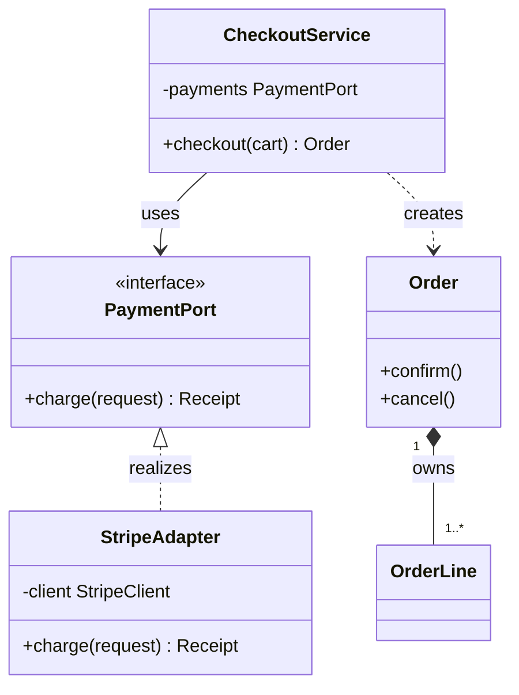
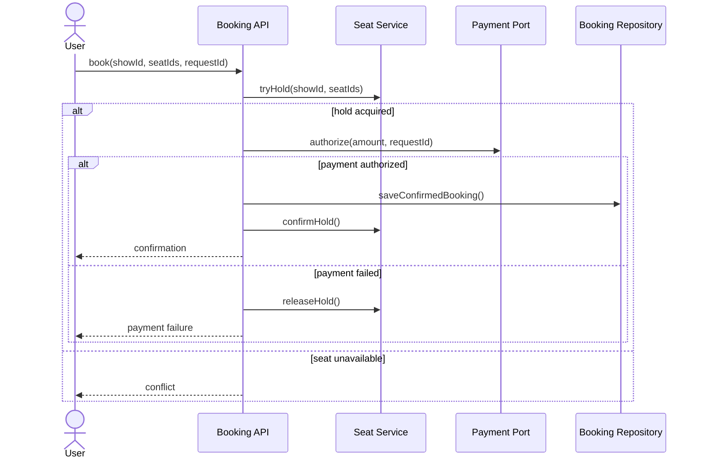
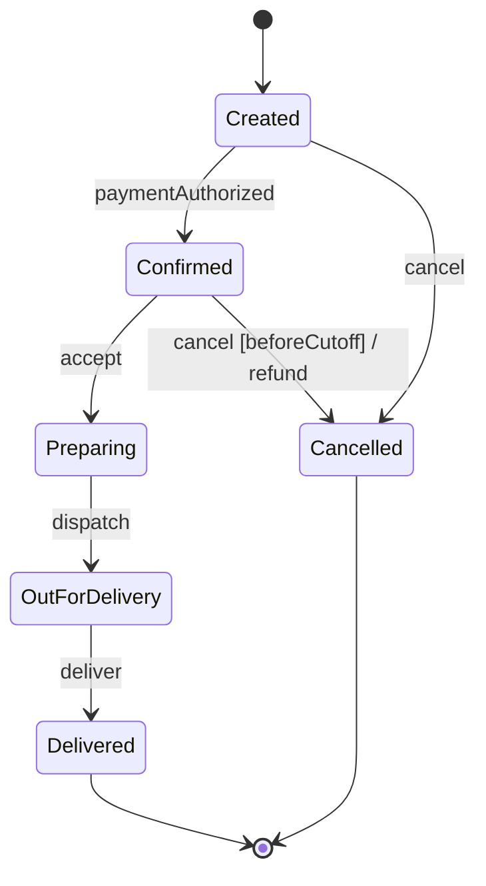

# Unified Modeling Language (UML)

## Overview

UML is a standardized visual language for describing software structure and behavior. In low-level design, class, sequence, and state-machine diagrams answer complementary questions:

- **Class diagram:** what types and structural relationships exist?
- **Sequence diagram:** how do participants collaborate over time for one scenario?
- **State-machine diagram:** how does one entity move between lifecycle states?

Use the smallest diagram that resolves the design question. UML is a communication tool, not a substitute for requirements or code.

## Why do we need it?

Prose alone can hide ownership, cardinality, dependency direction, call order, failure paths, and allowed transitions. A focused diagram makes assumptions reviewable before implementation and helps interviewers follow a design. Formal notation matters when ambiguity matters; in a time-boxed interview, a clear legend and consistent notation matter more than decorative completeness.

## How does it work?

### Class diagrams

A class box may show name, attributes, and operations. Visibility is commonly `+` public, `-` private, `#` protected, and `~` package. Italics or `{abstract}` mark abstract classifiers; `<<interface>>` marks an interface.

Key relationships:

| Relationship | Notation | Meaning |
| --- | --- | --- |
| Generalization | solid line, hollow triangle toward parent | subtype inheritance |
| Realization | dashed line, hollow triangle toward interface | implementation of a contract |
| Association | solid line | structural link between instances |
| Dependency | dashed arrow toward supplier | temporary use, such as a parameter or call |
| Shared aggregation | hollow diamond at whole | weak whole–part association; use sparingly |
| Composition | filled diamond at whole | exclusive whole–part ownership and lifecycle |

Multiplicity belongs at association ends: `1`, `0..1`, `*`, `0..*`, or `1..*`. Navigability arrows, role names, and constraints can remove ambiguity.



The filled diamond is justified only if `OrderLine` is an exclusive part of one `Order`. A `Ride` referencing a `Driver` is normally a plain association, because the ride does not own the driver's lifecycle. Shared aggregation adds little beyond association in many software models; do not use a diamond merely because one class has a field.

### Sequence diagrams

Sequence diagrams model one scenario. Participants appear across the top, time flows downward, lifelines show existence, and activation bars may show execution. Common messages include synchronous calls, asynchronous messages, returns, and self-calls.

Combined fragments express control:

- `alt` for mutually exclusive branches;
- `opt` for an optional branch;
- `loop` for repetition;
- `par` for concurrent fragments;
- `break` for terminating the enclosing interaction.



Show the behavior that affects the decision: failure, retry, transaction boundary, asynchronous delivery, or concurrency. Avoid turning the diagram into a list of every getter and mapper.

### State-machine diagrams

A state machine models a stateful entity's permitted transitions. A transition is commonly labeled:

```text
event [guard] / effect
```

States may define entry, exit, and internal behavior. Include initial and final pseudostates where useful. A state diagram should distinguish a **state**—a meaningful behavioral condition—from a raw status field.



List illegal or guarded transitions explicitly when they are important. A transition table can complement the picture for exhaustive validation.

### Choosing and combining diagrams

| Design question | Best starting diagram |
| --- | --- |
| Types, ownership, cardinality, dependencies | Class |
| One request's calls, order, branches, async work | Sequence |
| Valid lifecycle transitions and state-dependent behavior | State machine |

For ticket booking, a class diagram describes `Show`, `ShowSeat`, and `Booking`; a sequence diagram exposes seat-hold and payment failure ordering; a state machine defines booking or seat lifecycle. These diagrams should agree but need not duplicate every detail.

### Modelling workflow

1. State the diagram's question and scope.
2. Add only participants or states relevant to that question.
3. Label relationships, multiplicities, messages, guards, and important failures.
4. Validate the diagram against a concrete scenario and domain invariants.
5. Update or discard it when it no longer communicates the implementation.

### Common mistakes

- Drawing classes before clarifying requirements and invariants.
- Using composition diamonds for every field or collection.
- Omitting multiplicity and role names on ambiguous associations.
- Modelling object call order in a class diagram.
- Using a sequence diagram as a static architecture map.
- Showing only a happy path when failures determine correctness.
- Treating statuses as states without defining events, guards, or legal transitions.
- Mixing business lifecycle state with transient UI state.
- Over-specifying framework details that obscure the design decision.

### Source-derived diagram walkthroughs

The source tutorial begins with the communication problem: instead of describing classes, relationships, interactions, and state changes only in prose, draw the question that matters. For LLD interviews, the three most useful views are class, sequence, and state diagrams.

#### Class diagram walkthrough

A class diagram shows classes, attributes, methods, and relationships. The source's parking-lot sketch starts with:

```text
ParkingLot
    |
    +---- ParkingFloor
               |
               +---- ParkingSpot
```

and expands the class compartments:

```text
+----------------+
| ParkingLot     |
+----------------+
| floors         |
+----------------+
| park()         |
| unpark()       |
+----------------+

         |
         v

+----------------+
| ParkingFloor   |
+----------------+
| spots          |
+----------------+

         |
         v

+----------------+
| ParkingSpot    |
+----------------+
| id             |
| type           |
+----------------+
```

Use a class diagram for object modelling, structural relationships, and the main LLD overview. A common mistake is creating this diagram before understanding requirements.

> **Professional correction:** The plain arrows above preserve the source sketch's meaning but do not claim ownership. In precise UML, label associations and multiplicities, and use a filled composition diamond only for exclusive lifecycle ownership.

#### Sequence diagram walkthrough

A sequence diagram answers “Who calls whom, and in what order?” It models behavior, not static structure. The source's BookMyShow flow is:

```text
User
 |
 | Book Seat
 v
BookingService
 |
 | Lock Seat
 v
SeatService
 |
 | Save Booking
 v
BookingRepository
```

The more detailed call/return-oriented version is:

```text
User
 |
 | bookSeat()
 v
BookingService
 |
 | lockSeat()
 v
SeatService
 |
 | success
 v
BookingService
 |
 | saveBooking()
 v
BookingRepository
```

Use sequence diagrams for request flows, APIs, and service interactions. Do not put static class relationships in a sequence diagram.

> **Professional correction:** A successful seat lock alone is not the whole booking contract. The Mermaid diagram above retains the professional failure branches for unavailable seats and payment failure, including release/compensation.

#### State diagram walkthrough

A state diagram shows how an object changes behavioral state. The source gives a Swiggy-style order lifecycle:

```text
Created
   |
   v
Confirmed
   |
   v
Preparing
   |
   v
OutForDelivery
   |
   v
Delivered
```

and an ATM transaction lifecycle:

```text
Idle
  |
  v
CardInserted
  |
  v
Authenticated
  |
  v
TransactionProcessing
  |
  v
Completed
```

Use this view for order and booking lifecycles, workflow systems, and designs that may warrant the State pattern. Do not use a class diagram to represent transitions.

> **Professional correction:** A list of statuses is only a starting sketch. A state machine becomes precise when transitions identify events, guards, effects, initial/final states, and illegal paths.

### Source-derived diagram selection card

| Problem | Diagram |
| --- | --- |
| Object modelling and ownership | Class diagram |
| Request or interaction flow | Sequence diagram |
| Status/lifecycle transitions | State-machine diagram |

```text
Class Diagram
    ↓
What exists?

Sequence Diagram
    ↓
What happens?

State Diagram
    ↓
What changes?
```

### Source-derived interview example: BookMyShow

Each diagram answers a different question.

Class candidates:

```text
Movie
Theatre
Screen
Seat
Booking
```

Interaction flow:

```text
User
  |
  v
BookingService
  |
  v
SeatService
  |
  v
PaymentService
```

Seat lifecycle:

```text
Available
    |
    v
Locked
    |
    v
Booked
```

> **Professional correction:** For a fuller domain model, distinguish a physical `Seat` from a per-show `ShowSeat`; add lock expiry, release, payment failure, and atomic store enforcement where correctness depends on them.

### Source-derived critical learnings and answers

- Class diagrams model structure.
- Sequence diagrams model behavior and interaction order.
- State diagrams model lifecycle transitions.
- Most LLD interviews need at least a class diagram.
- Sequence diagrams explain workflows clearly.
- State diagrams are especially useful for state-heavy systems.
- **Class vs sequence diagram?** Structure versus interaction flow.
- **When should you use a state diagram?** When permitted behavior changes with lifecycle state.
- **Most common UML diagram in LLD interviews?** The class diagram.
- **Is perfect UML notation required in interviews?** No. Clear communication matters more, while ownership, multiplicity, failures, and transitions deserve precision.

Fast revision:

| Diagram | Purpose |
| --- | --- |
| Class | Structure |
| Sequence | Interaction flow |
| State machine | State transitions |

## Advantages

- Makes structure, interaction, and lifecycle assumptions visible.
- Reveals missing cardinalities, ownership, failure paths, and transitions.
- Gives teams a language-independent design vocabulary.
- Supports focused review before implementation.
- Helps explain an interview design quickly.

## Limitations

- Diagrams drift unless maintained with the code.
- Dense diagrams become harder to understand than prose.
- UML does not establish runtime correctness, performance, or transactional guarantees.
- Tool-specific syntax may support only a subset of the UML standard.
- Formal precision can cost more than it adds for short-lived sketches.

## Real-world examples

- A class diagram captures payment ports and provider adapters.
- A sequence diagram documents checkout compensation after payment failure.
- A state machine defines order, booking, document, ATM, or vending-machine lifecycles.
- A `par` fragment documents concurrent calls; notes identify where an atomic store operation enforces correctness.

## Interview Questions

1. How do class, sequence, and state-machine diagrams differ?
2. What is the difference between association, shared aggregation, and composition?
3. How do you show interface realization and a temporary dependency?
4. Where do multiplicities appear, and what does `0..1` mean?
5. How would you show errors, optional behavior, loops, and concurrency in a sequence diagram?
6. What belongs on a state transition label?
7. Do interviews require perfect UML notation?
8. **Interview tip:** declare a compact legend, model one critical flow, and spend precision on ownership, multiplicity, failures, and state transitions.

## References

- [Object Management Group: UML 2.5.1 Specification](https://www.omg.org/spec/UML/2.5.1/About-UML)
- [Martin Fowler: UML Distilled resources](https://martinfowler.com/books/uml.html)
- [Mermaid: Class Diagrams](https://mermaid.js.org/syntax/classDiagram.html)
- [Mermaid: Sequence Diagrams](https://mermaid.js.org/syntax/sequenceDiagram.html)
- [Mermaid: State Diagrams](https://mermaid.js.org/syntax/stateDiagram.html)
- [Related: Principles](../Principles/README.md)

## Provenance

- **Source-derived:** “Source-derived diagram walkthroughs,” selection card, BookMyShow example, critical learnings, interview answers, ASCII diagrams, and fast-revision card derive from `01-core/uml.md`.
- **Editorial synthesis:** The repository topic template, formal notation tables, Mermaid renderings, modelling workflow, consolidated mistakes, links, and removal of exact repeated purpose statements.
- **Professional correction:** Every callout explicitly labeled **Professional correction**, plus the existing distinctions between association/aggregation/composition, complete sequence failure paths, and event/guard/effect state-machine semantics. These additions preserve the source sketches while preventing their simplified arrows and status lists from being mistaken for complete UML.
