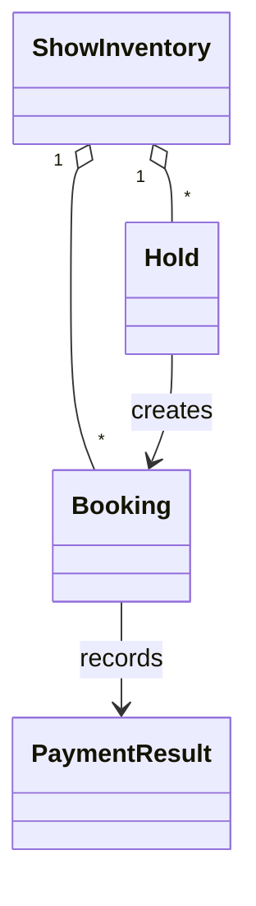
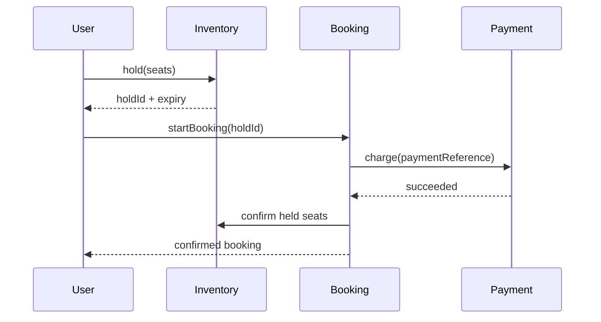

# BookMyShow

> **Provenance:** Editorial addition; the matching source stub was empty.

This ticketing system moves seats through a controlled checkout lifecycle.
Customers first view availability, then hold a set of seats for a short time,
create a booking, pay, and receive confirmation. A hold prevents another
customer from buying the same seats while checkout is in progress.

The actors are the customer, payment provider, expiry worker, and operator.
The core entities are show inventory, holds, bookings, and payment results. A
seat is `AVAILABLE`, `HELD`, or `BOOKED`; a booking is `PENDING_PAYMENT`,
`CONFIRMED`, `PAYMENT_FAILED`, or `EXPIRED`. These state machines make legal
transitions and recovery paths explicit.

## Problem Statement
Design a ticketing service that lets users discover a show, temporarily reserve seats, pay, and receive a booking without overselling inventory during concurrent demand.

## Normal Flow, Before the Diagrams

1. A customer reads a possibly cached seat map.
2. Checkout asks the authoritative inventory service to hold every selected
   seat together. If even one is unavailable, nothing is held.
3. The customer starts a `PENDING_PAYMENT` booking while the hold is live.
4. The payment provider sends a result identified by a stable reference.
5. Success changes the booking to `CONFIRMED` and the seats from `HELD` to
   `BOOKED`; failure or expiry releases them.

The central race is two customers requesting the same seat. A transaction or
lock lets only one change `AVAILABLE` to `HELD`. Read maps may be stale, but the
write authority must be strongly consistent. Money is handled by the payment
provider; this model records outcomes and references, and reconciles a late
success rather than charging or confirming twice.

## Functional Requirements
- View seat availability for a show.
- Atomically hold one or more seats for a bounded time.
- Create a pending booking and process idempotent payment callbacks.
- Confirm paid bookings; release seats after failed payments or expired holds.

Detailed scope and invariants are in [Requirements](Requirements.md).

## Non Functional Requirements
- No seat may be held or sold to two users at once.
- Availability and booking writes must be strongly consistent per show.
- Reads should remain low-latency under bursty traffic.
- Payment retries, process crashes, and delayed callbacks must be recoverable and observable.

## Design Decisions
Inventory is partitioned by show and seat so conflicting requests meet at one
consistency boundary. A transactional write serializes those claims. A
time-to-live (TTL) hold protects checkout without permanently consuming
inventory. Booking and payment have explicit state machines so retries and
late callbacks can be handled safely, and payment references provide
idempotency. See [Design](Design.md) for persistence, scaling, and failure
handling.

## Class Diagram
The model separates show inventory, temporary holds, bookings, and payment outcomes.



Full diagram: [UML](UML/README.md).

## Sequence Diagram
Checkout first acquires a hold, then creates a pending booking, and only converts seats to sold inventory after a successful payment.



Detailed flows: [Sequence Diagrams](Sequence-Diagrams/README.md).

## Complexity
For `s` requested seats and `h` active holds, the compact in-memory reference has `O(s + h)` hold checks and `O(s)` confirmation. A production indexed seat table makes conflicting-seat acquisition approximately `O(s log n)` while storage is `O(n + b)` for seats and bookings.

## Future Improvements
- Add a transactional outbox for payment and notification events.
- Use a database lease plus fencing/version fields across service instances.
- Add waitlists, dynamic pricing, refunds, and partial cancellation.
- Cache read-only seat maps with version-based invalidation.

## Run the Reference Implementation
The Java 17 single-file implementation and self-tests are at [BookMyShow.java](implementation/java/BookMyShow.java).

```bash
javac implementation/java/BookMyShow.java
java -cp implementation/java BookMyShow
```
