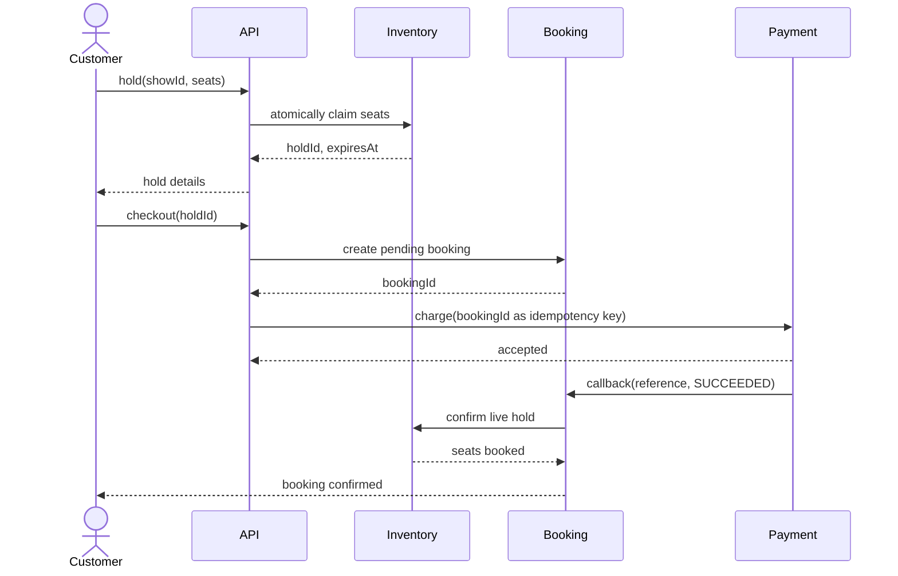
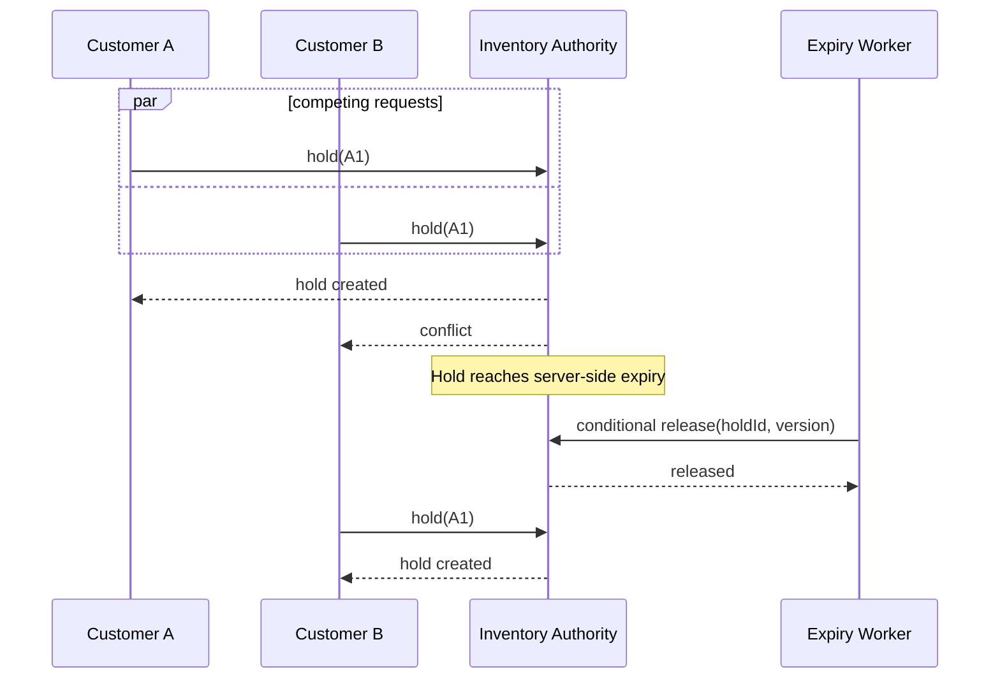

# BookMyShow Sequence Diagrams

## Successful Checkout

## Concurrent Hold and Expiry

The authority serializes conflicting writes; the worker's conditional update cannot release a seat after confirmation or a newer lease.

Back to the [overview](../README.md), [requirements](../Requirements.md), or [design](../Design.md).
