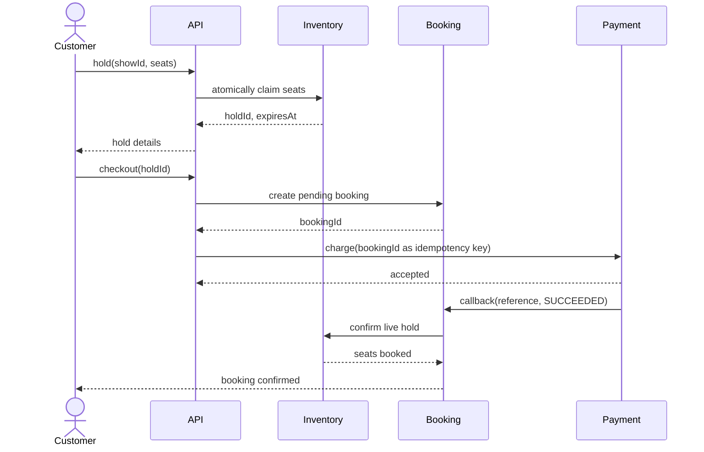
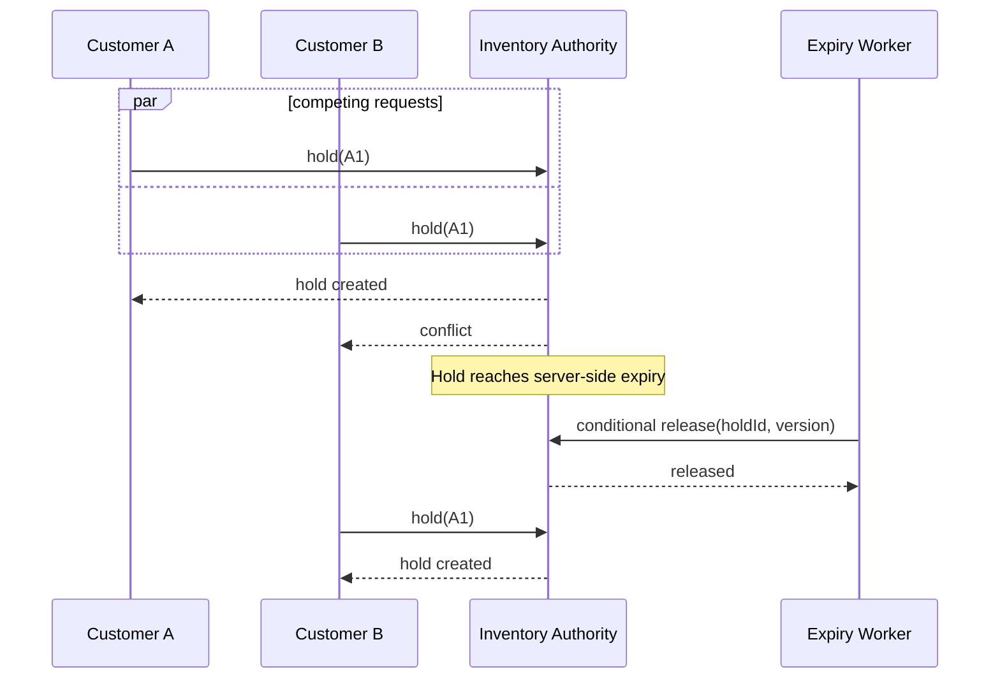

# BookMyShow Sequence Diagrams

## Successful Checkout

These diagrams show time from top to bottom. In the normal flow, the customer
holds seats, creates a pending booking, and receives confirmation after a
provider callback. The second flow explains the race between customers and an
expiry worker; serialization and a conditional version check prevent both a
double booking and an old worker releasing newer state.

## Concurrent Hold and Expiry

This second Mermaid sequence introduces the main race and cleanup edge case.
Customers A and B ask for the same seat while an expiry worker may later release
it. The inventory authority orders those writes, and the worker supplies the
hold version so it cannot erase a confirmed booking or a newer hold.

The authority serializes conflicting writes; the worker's conditional update cannot release a seat after confirmation or a newer lease.

Back to the [overview](../README.md), [requirements](../Requirements.md), or [design](../Design.md).
