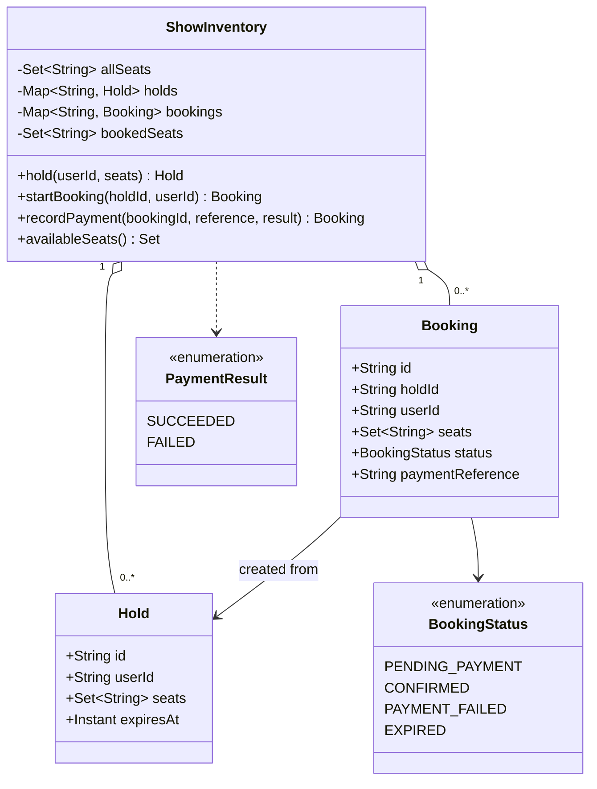

# BookMyShow Class Model

`ShowInventory` is the aggregate and synchronization boundary in the reference implementation. Records are immutable snapshots; mutations replace a booking after validating its legal transition.

Back to the [overview](../README.md), [design](../Design.md), or [source](../implementation/java/BookMyShow.java).
