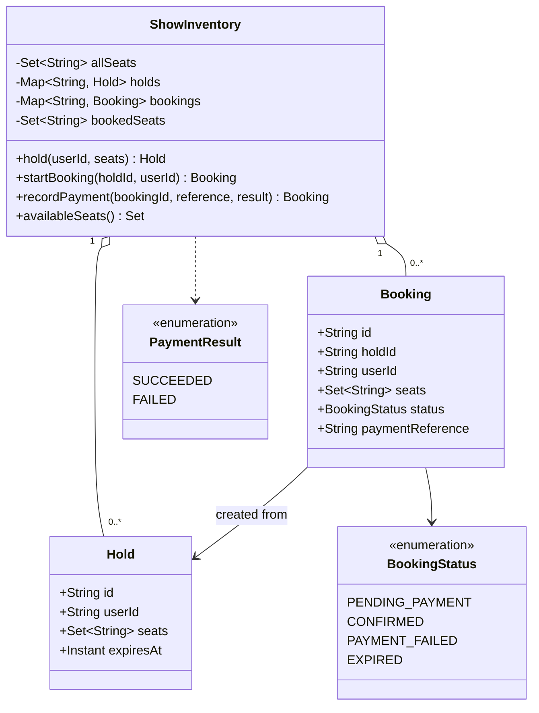

# BookMyShow Class Model

Before reading the arrows, remember the checkout: inventory creates a temporary
hold, a booking is created from that hold, and payment moves it to a terminal
state. `ShowInventory` exists as the aggregate and race boundary; `Hold` records
ownership and expiry; `Booking` records customer and payment state; the enums
limit results to named legal values. Composition arrows mean the inventory owns
collections of holds and bookings; dependency arrows mean a method consumes a
value without owning it.

The following Mermaid class diagram is a static map of those responsibilities,
not the order of runtime calls.

`ShowInventory` is the aggregate and synchronization boundary in the reference implementation. Records are immutable snapshots; mutations replace a booking after validating its legal transition.

Back to the [overview](../README.md), [design](../Design.md), or [source](../implementation/java/BookMyShow.java).
