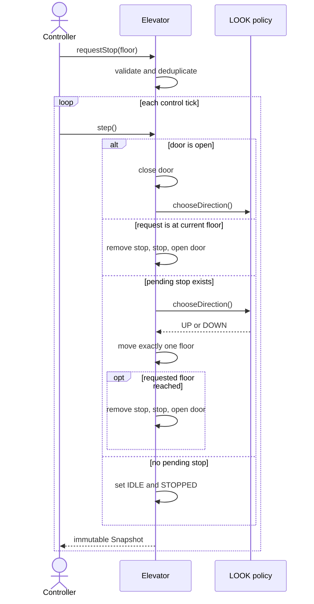

# Request Service Sequence

```mermaid
sequenceDiagram
    actor Controller
    participant Elevator
    participant Scheduler as LOOK policy

    Controller->>Elevator: requestStop(floor)
    Elevator->>Elevator: validate and deduplicate
    loop each control tick
        Controller->>Elevator: step()
        alt door is open
            Elevator->>Elevator: close door
            Elevator->>Scheduler: chooseDirection()
        else request is at current floor
            Elevator->>Elevator: remove stop, stop, open door
        else pending stop exists
            Elevator->>Scheduler: chooseDirection()
            Scheduler-->>Elevator: UP or DOWN
            Elevator->>Elevator: move exactly one floor
            opt requested floor reached
                Elevator->>Elevator: remove stop, stop, open door
            end
        else no pending stop
            Elevator->>Elevator: set IDLE and STOPPED
        end
        Elevator-->>Controller: immutable Snapshot
    end
```

Door and scheduling invariants are explained in [Design.md](../Design.md). See also the [class diagram](../UML/README.md) and [overview](../README.md).
