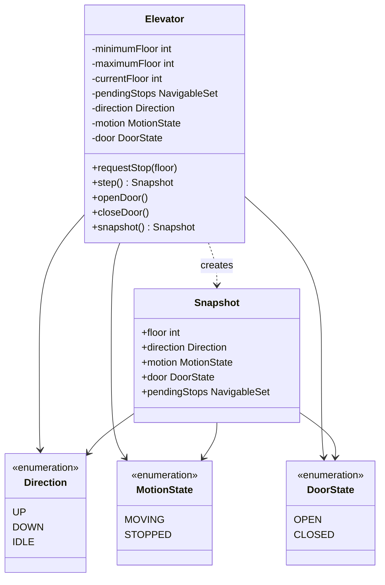

# Class Diagram

```mermaid
classDiagram
    class Elevator {
        -minimumFloor int
        -maximumFloor int
        -currentFloor int
        -pendingStops NavigableSet
        -direction Direction
        -motion MotionState
        -door DoorState
        +requestStop(floor)
        +step() Snapshot
        +openDoor()
        +closeDoor()
        +snapshot() Snapshot
    }
    class Snapshot {
        +floor int
        +direction Direction
        +motion MotionState
        +door DoorState
        +pendingStops NavigableSet
    }
    class Direction {
        <<enumeration>>
        UP
        DOWN
        IDLE
    }
    class MotionState {
        <<enumeration>>
        MOVING
        STOPPED
    }
    class DoorState {
        <<enumeration>>
        OPEN
        CLOSED
    }

    Elevator ..> Snapshot : creates
    Elevator --> Direction
    Elevator --> MotionState
    Elevator --> DoorState
    Snapshot --> Direction
    Snapshot --> MotionState
    Snapshot --> DoorState
```

See the [design](../Design.md), [sequence diagram](../Sequence-Diagrams/README.md), and [overview](../README.md).
