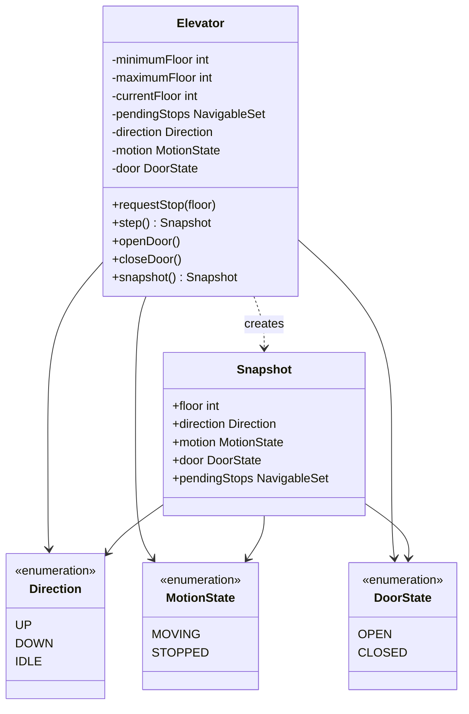

# Class Diagram

A request is stored in `Elevator`, `step()` changes the car by at most one floor,
and `Snapshot` reports the result. `Elevator` exists as the safety boundary;
`Snapshot` prevents outside mutation; the three enums model independent
direction, movement, and door states.

The following Mermaid class diagram shows structure, not timing. Read `..>` as
“creates or uses” and `-->` as “holds or refers to.”

See the [design](../Design.md), [sequence diagram](../Sequence-Diagrams/README.md), and [overview](../README.md).
