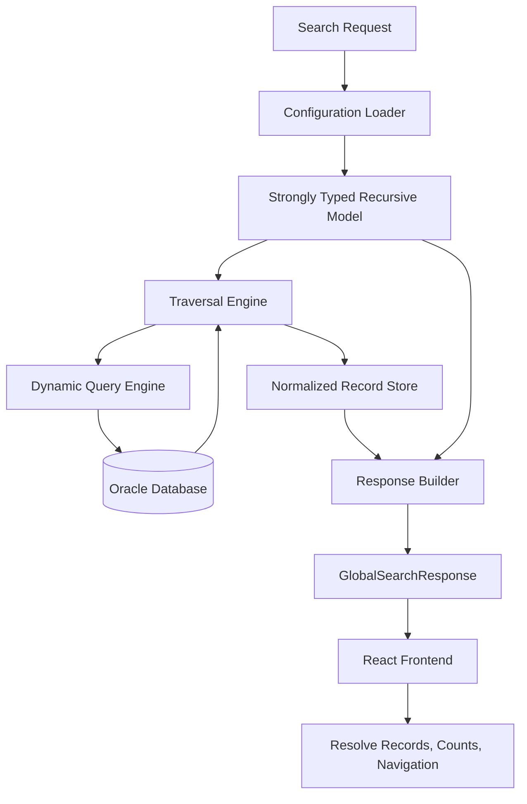

# Global Search

Global Search is a configuration-driven investigation platform built at Osfin.ai for implementation and operations teams. Its name is historical: each business module already had search; the unmet problem was investigating related data across transactions, merchants, customers, settlements, banking, and disputes after the first record had been found.

The project was developed in a FinTech environment during 2023–2024 with Java, Spring Boot, React, Oracle SQL, and REST APIs. The author, a Software Engineer II, owned stakeholder discovery, configuration design, backend architecture and APIs, dynamic SQL, relationship traversal, result aggregation, performance optimization, frontend integration, production rollout, and enhancements.

> **Editorial addition:** This consolidated case study distinguishes source-described behavior from professional corrections and recommendations. It does not claim measured latency, adoption, query reduction, or effort-reduction figures because the sources provide none.

## Beginner Orientation

### Real-world problem

An operations analyst may find a suspicious transaction but still needs to
follow its merchant, customer, settlement, banking, and dispute records. Before
this platform, each investigation path required manual module hopping or a new
hardcoded API. “Global Search” therefore means cross-module **investigation**,
not replacing each module's ordinary search.

### Actors, entities, and states

- **Operations and implementation teams** run investigations and define
  approved workflows.
- A `SearchRequest` supplies a configuration, allowed search column, and value.
- `SearchConfiguration` describes modules and parent-child edges.
- The traversal and query engines fetch rows; the normalized store deduplicates
  them; the response builder creates the hierarchy; React presents it.
- A configuration should move through draft, validated, published, and retired
  operational states, although the historical source does not define that
  lifecycle. A request is rejected, running, successful-empty, successful with
  results, or failed; these names are explanatory, not source enums.

### Normal flow before architecture

1. An analyst submits a known identifier.
2. The backend loads and validates a published configuration.
3. It queries the root module and stores each row once by table and ID.
4. For every configured edge, it collects and deduplicates parent values, then
   fetches children in batches instead of one query per parent.
5. After acquisition ends, a separate in-memory pass builds the hierarchy.
6. The frontend resolves hierarchy IDs against normalized records and renders
   the investigation.

Concurrent searches mostly read independent state; the important consistency
boundary is the immutable configuration version used for an entire request.
Database rows can change during a long investigation, so production must choose
snapshot or documented read-consistency semantics. Amount fields are business
data, not calculated or transferred by this platform; authorization, redaction,
and exact database types still matter. Failures include invalid metadata,
unsafe identifiers, timeouts, partial database availability, excessive depth,
and oversized results. Later sections preserve the source behavior and label
professional corrections, complexity qualifications, and trade-offs.

## Table of Contents

- [Project at a Glance](#project-at-a-glance)
- [Business Problem](#business-problem)
- [Solution and Design Goals](#solution-and-design-goals)
- [Architecture](#architecture)
- [Configuration Model](#configuration-model)
- [Source-derived Implementation Context](#source-derived-implementation-context)
- [Traversal and Response Algorithms](#traversal-and-response-algorithms)
- [Dynamic SQL](#dynamic-sql)
- [Batching and End-to-End Walkthroughs](#batching-and-end-to-end-walkthroughs)
- [Response Contract and Frontend Boundary](#response-contract-and-frontend-boundary)
- [Correctness and Error Handling](#correctness-and-error-handling)
- [Complexity and Performance](#complexity-and-performance)
- [Decisions, Trade-offs, and Limitations](#decisions-trade-offs-and-limitations)
- [Impact and Future Enhancements](#impact-and-future-enhancements)
- [Interview Guide](#interview-guide)
- [Q1–Q31 Interview Answers](#q1q31-interview-answers)
- [Mock Interview Rounds](#mock-interview-rounds)
- [Final Tips and Notes](#final-tips-and-notes)
- [Provenance](#provenance)

## Project at a Glance

- **Company:** Osfin.ai
- **Role:** Software Engineer II
- **Duration:** 2023–2024
- **Domain:** FinTech
- **Technology:** Java, Spring Boot, React, Oracle SQL, REST APIs
- **Project type:** Investigation platform
- **Architecture:** Configuration-driven
- **Primary users:** Implementation and operations teams

The central contribution was a generic traversal engine and configuration model. The principal engineering challenges were supporting many workflows, designing flexible metadata, generating SQL dynamically, traversing relationships, avoiding N+1 queries, maintaining database performance, producing configurable result formats, and adding workflows without changing traversal code.

## Business Problem

The difficult part began after an initial record was found. Depending on the issue, a user starting with a Merchant ID might have to move through Transactions, Settlements, Banking, or Disputes in a particular sequence. Different scenarios had different sequences.

The old approach had structural costs:

- teams manually navigated several modules;
- investigation knowledge remained with experienced team members;
- there was no standardized investigation experience;
- each new flow repeated APIs, SQL, DTOs, response builders, tests, and frontend integration;
- similar queries and traversal logic were repeatedly implemented;
- testing effort and maintenance grew with the number of hardcoded workflows;
- a small relationship change required engineering, testing, and deployment.

The repeated API pattern was always broadly the same:

```text
Execute root query
        ↓
Find related records
        ↓
Build response
        ↓
Return hierarchy
```

Only the entities and relationships changed. The goal was therefore to move this variable behavior from application code into governed metadata while retaining one reusable runtime.

## Solution and Design Goals

Implementation teams could define:

- the root business entity and database table;
- searchable columns;
- display fields and response metadata;
- parent-child relationships and traversal order;
- result format.

At runtime, the backend accepts a request, loads and deserializes its configuration, searches the root table, traverses configured relationships, aggregates related information, and formats a generic result. A valid new workflow should normally require configuration changes only; the traversal engine, module-specific repositories, and response builder remain unchanged.

The design goals were:

1. **Configuration-driven behavior:** avoid module-specific workflow implementations.
2. **Generic traversal:** execute every configured module with the same recursive algorithm.
3. **Performance:** batch child retrieval instead of querying once per discovered parent.
4. **Extensibility:** add workflows by changing metadata.
5. **Separation of concerns:** isolate database acquisition from response construction.
6. **Maintainability:** deserialize JSON into typed Java models instead of walking raw JSON.

## Architecture

### High-level components

The following Mermaid flowchart introduces the major runtime components and the
direction data moves during one normal investigation. It is an architecture
view, not a class diagram or a guarantee that every arrow is a network call.



The five source-defined components are:

1. **Search Configuration** — the recursive workflow blueprint.
2. **Traversal Engine** — discovers all participating entities without module knowledge.
3. **Dynamic Query Engine** — resolves table, search column, values, and relationships at runtime.
4. **Normalized Record Store** — keeps each discovered business record by table and ID.
5. **Response Builder** — creates the recursive hierarchy from in-memory records.

### Request lifecycle and two-phase processing

```text
Search Request
      │
      ▼
Load and Deserialize Search Configuration
      │
      ▼
Phase 1 — Data Acquisition
      │
      ▼
Execute Root Query
      │
      ▼
Store Records by Table and ID
      │
      ▼
Collect Parent-Column Values
      │
      ▼
Execute Batched Child Query
      │
      ▼
Repeat Until Leaf Configuration
      │
      ▼
Normalized Record Store
      │
      ▼
Phase 2 — Response Construction (no database queries)
      │
      ▼
GlobalSearchResponse
      │
      ▼
Frontend Resolves Records, Counts, and Hierarchy
```

Phase 1 loads the root configuration, executes the root query, recursively traverses configured relationships, batches child queries, and stores discovered records. Phase 2 reads that store, creates `NestedSearchResponse` and `SearchResponseRecordMapping` objects, and produces `GlobalSearchResponse`. Keeping acquisition and composition separate isolates database access, gives each recursion one responsibility, simplifies debugging, and allows retrieval and response optimizations to evolve independently.

The architecture follows only configured relationships; it does not scan unrelated modules. Execution is therefore deterministic with respect to the selected configuration.

### Hierarchy meaning

A configuration can express branching:

```text
Transaction
│
├── Merchant
│   ├── Customer
│   └── Settlement
│
└── Dispute
```

Every node is a business module; every edge says how a parent column connects to a child column. Because each node may itself have children, both configuration and response are recursive.

## Configuration Model

Configurations are stored as JSON but are deserialized before traversal. Typed objects provide compile-time type safety, cleaner recursion, easier validation, and a simpler path for new metadata.

Relationship metadata belongs to the edge (`RelatedModule`), not intrinsically to either node. This allows a module configuration to participate in more than one workflow with different connections.

The source model conceptually contains:

```text
SearchConfiguration
├── tableName
├── searchableColumns
└── relatedModules
    └── RelatedModule
        ├── parentColumn
        ├── childColumn
        └── config: SearchConfiguration
```

One source relationship example was:

```text
Transaction Configuration
└── RelatedModule
    ├── parentColumn = transaction.id
    ├── childColumn  = merchant.transaction_id
    └── Merchant Configuration
```

### Representative configuration

> **Editorial addition:** The sources describe the fields but do not provide one complete configuration document. This representative JSON makes their recursive model concrete.

```json
{
  "id": "transaction-investigation",
  "root": {
    "module": "Transaction",
    "table": "transaction",
    "idColumn": "id",
    "searchableColumns": ["transaction_id", "merchant_id"],
    "displayColumns": ["transaction_id", "status", "amount"],
    "relatedModules": [
      {
        "parentColumn": "merchant_id",
        "childColumn": "id",
        "config": {
          "module": "Merchant",
          "table": "merchant",
          "idColumn": "id",
          "searchableColumns": ["id"],
          "displayColumns": ["id", "name"],
          "relatedModules": []
        }
      }
    ]
  }
}
```

## Source-derived Implementation Context

This section preserves the original names, shapes, examples, and behavior from the implementation source, including inconsistencies later addressed under professional corrections.

### Original core classes

```java
public class SearchConfiguration {
    private String tableName;
    private List<String> searchableColumns;
    private List<RelatedModule> relatedModules;
}

public class RelatedModule {
    private SearchConfiguration config;
    private String parentColumn;
    private String childColumn;
}

public class SearchRequest {
    private String configurationId;
    private String searchColumn;
    private String searchValue;
}

public class SearchResponseRecordMapping {
    private Long id;
    private List<NestedSearchResponse> mappedData;
}

public class NestedSearchResponse {
    private String tableName;
    private List<SearchResponseRecordMapping> recordMappings;
}

public class GlobalSearchResponse {
    private SearchConfiguration searchConfiguration;
    private Map<String, Map<String, Map<String, Object>>> tableToIdToRecordMapping;
    private NestedSearchResponse nestedSearchResponse;
}
```

`SearchResponseRecordMapping` stores only an entity ID and child mappings; business data remains in the normalized store. `NestedSearchResponse` represents one module in the hierarchy. `GlobalSearchResponse` combines the configuration, normalized records, and recursive tree.

The source says `SearchRequest` accepts one or more values and supports bulk searching, but the shown class has singular `String searchValue`. Its request example also uses capitalized `SearchValue`:

```json
{
  "configurationId": "merchant-search",
  "searchColumn": "merchant_id",
  "SearchValue": "1001"
}
```

The original root request and generic invocation were:

```java
fetchResults(
    config.tableName,
    searchRequest.searchColumn,
    List.of(searchRequest.searchValue)
);
```

### Original normalized store

```java
Map<String, Map<String, Map<String, Object>>> tableToIdToRecordMapping;
```

Its shape is:

```text
Table
└── Record ID
    └── Complete Business Record

merchant
├── 101
│   ├── id : 101
│   └── transaction_id : 10
└── 102 : {...}

customer
└── 501 : {...}
```

The source says `updateMap()` populates this map and `buildSearchResponse()` consumes it without further SQL. Keys are table name, then record identifier. Records are overwritten/deduplicated by ID when the same table record is encountered again.

### Original `updateMap()`

```java
public void updateMap(
        SearchConfiguration config,
        String column,
        List<String> values,
        Map<String, Map<String, Map<String, Object>>> tableToIdToRecordMapping) {

    List<Map<String, Object>> results =
            fetchResults(config.tableName, column, values);

    tableToIdToRecordMapping.putIfAbsent(config.tableName, new HashMap<>());

    results.forEach(result ->
        tableToIdToRecordMapping
            .get(config.tableName)
            .put(result.get("id").toString(), result)
    );

    for (RelatedModule relatedModule : config.relatedModules) {
        List<String> childSearchValues = results.stream()
                .map(v -> v.get(relatedModule.parentColumn).toString())
                .toList();

        updateMap(
                relatedModule.config,
                relatedModule.childColumn,
                childSearchValues,
                tableToIdToRecordMapping);
    }
}
```

For each module this method queries, stores records, reads every edge, collects parent-column values, and recursively queries each child by `childColumn`.

### Original `buildSearchResponse()`

```java
public NestedSearchResponse buildSearchResponse(
        SearchConfiguration config,
        String column,
        String value,
        Map<String, Map<String, Map<String, Object>>> tableToIdToRecordMapping) {

    NestedSearchResponse nestedSearchResponse =
            new NestedSearchResponse(config.tableName);

    List<Map<String, Object>> results =
            getResults(
                    tableToIdToRecordMapping,
                    config.tableName,
                    column,
                    value);

    results.forEach(result -> {
        SearchResponseRecordMapping recordMapping =
                new SearchResponseRecordMapping(
                        Long.parseLong(result.get("id").toString()));

        config.relatedModules.forEach(relatedModule -> {
            NestedSearchResponse childResponse =
                    buildSearchResponse(
                            relatedModule.config,
                            relatedModule.childColumn,
                            result.get(relatedModule.parentColumn).toString(),
                            tableToIdToRecordMapping);

            recordMapping.mappedData.add(childResponse);
        });

        nestedSearchResponse.recordMappings.add(recordMapping);
    });

    return nestedSearchResponse;
}
```

This creates the current module response, locates in-memory matches, creates one ID-only mapping per match, recursively builds children, and returns the tree. It never contacts the database.

### Original response examples

Multiple root matches produce separate root trees:

```text
Search Results

Transaction 101
└── Merchant
    ├── Customer
    └── Customer

Transaction 102
└── Merchant
    └── Customer

Transaction 103
└── Merchant
    ├── Customer
    └── Customer
```

A recursive call can build:

```text
Transaction
├── Merchant
│   ├── Customer
│   └── Customer
└── Merchant
    └── Customer
```

### Professional corrections and hardened model

> **Editorial addition:** These are corrections and production hardening retained from the current case study; they are not claims about the exact historical implementation.

- Replace singular `searchValue` with `List<String> searchValues` if bulk search is part of the contract, and use consistent JSON casing.
- Make `idColumn` explicit rather than assuming every table uses `"id"`.
- Include module/display metadata where required by the frontend.
- Filter null relationship values and deduplicate them before recursion.
- Return immediately for an empty value list instead of generating `IN ()`.
- Track visited configuration nodes or edges, enforce maximum depth, and reject cycles during publication.
- Build secondary in-memory indexes for relationship columns; repeated full-map scans can otherwise make response composition superlinear.
- Validate identifiers against trusted metadata and an application allowlist; configuration origin alone is not an adequate authorization boundary.
- Enforce row/column authorization separately from configuration validity.

```java
record SearchConfiguration(
        String module,
        String table,
        String idColumn,
        Set<String> searchableColumns,
        List<String> displayColumns,
        List<RelatedModule> relatedModules) {}

record RelatedModule(
        String parentColumn,
        String childColumn,
        SearchConfiguration config) {}

record SearchRequest(
        String configurationId,
        String searchColumn,
        List<String> searchValues) {}

record RecordMapping(
        String id,
        List<NestedSearchResponse> children) {}

record NestedSearchResponse(
        String module,
        List<RecordMapping> records) {}

record GlobalSearchResponse(
        SearchConfiguration configuration,
        Map<String, Map<String, Map<String, Object>>> recordsByTableAndId,
        NestedSearchResponse hierarchy) {}
```

## Traversal and Response Algorithms

### Phase 1 — acquire and normalize

The source algorithm:

1. executes the current search query;
2. stores fetched rows in `tableToIdToRecordMapping`;
3. collects values from each edge's `parentColumn`;
4. issues one child lookup per configured `RelatedModule` using `childColumn`;
5. recurses until a leaf or empty result.

> **Editorial addition:** A hardened formulation makes the source behavior and safeguards explicit.

```java
void acquire(
        SearchConfiguration config,
        String searchColumn,
        List<String> values,
        RecordStore store) {

    if (values.isEmpty()) return;
    validateAllowedIdentifier(config, searchColumn);

    List<Map<String, Object>> rows =
            queryExecutor.fetch(config.table(), searchColumn, values);
    store.putAll(config.table(), config.idColumn(), rows);

    for (RelatedModule edge : config.relatedModules()) {
        List<String> childKeys = rows.stream()
                .map(row -> row.get(edge.parentColumn()))
                .filter(Objects::nonNull)
                .map(Object::toString)
                .distinct()
                .toList();

        acquire(edge.config(), edge.childColumn(), childKeys, store);
    }
}
```

### Phase 2 — build mappings

The response builder looks up records in memory, maps IDs, and follows the same edge metadata. A leaf has no configured child modules. An empty lookup returns an empty mapping.

> **Editorial addition:** The efficient version assumes secondary indexes for `store.find`.

```java
NestedSearchResponse build(
        SearchConfiguration config,
        String column,
        String value,
        RecordStore store) {

    List<RecordMapping> mappings = store.find(config.table(), column, value).stream()
            .map(row -> {
                List<NestedSearchResponse> children = config.relatedModules().stream()
                        .map(edge -> build(
                                edge.config(),
                                edge.childColumn(),
                                Objects.toString(row.get(edge.parentColumn())),
                                store))
                        .toList();
                return new RecordMapping(
                        Objects.toString(row.get(config.idColumn())), children);
            })
            .toList();

    return new NestedSearchResponse(config.module(), mappings);
}
```

DFS was selected because it maps directly to recursive configuration and the business hierarchies were shallow. BFS is also valid and becomes preferable for level-wide scheduling, breadth limits, or controlled parallel execution. An iterative traversal can avoid stack risk for untrusted depth.

## Dynamic SQL

Every query is determined by target table, search column, search values, and edge metadata. This avoided module-specific methods such as:

```java
findTransactions(...)
findMerchants(...)
findCustomers(...)
findSettlements(...)
```

The original source illustrates root and child SQL with:

```sql
SELECT *
FROM transaction
WHERE transaction_id IN (...);
```

```sql
SELECT *
FROM merchant
WHERE transaction_id IN (101,102,103,104);
```

The request's search column is checked against `SearchConfiguration.searchableColumns`; unsupported columns are rejected.

### SQL safety

Values can be bound, but SQL identifiers cannot. The source states that table names and searchable columns originate from trusted configuration and user values are parameterized.

> **Editorial addition:** Production safety requires the stronger controls below.

1. Tables, columns, and projections must come from a trusted, versioned, validated allowlist.
2. A requested search column must be in `searchableColumns`.
3. Search values must always use bind parameters.
4. Empty lists must short-circuit.
5. Large lists must be chunked according to Oracle and driver limits.
6. Configured projections should replace `SELECT *` to reduce I/O and accidental exposure.

```sql
SELECT id, transaction_id, merchant_id, status, amount
FROM transaction
WHERE transaction_id IN (:value_0, :value_1);
```

```java
// Identifiers have already passed configuration allowlist validation.
String placeholders = IntStream.range(0, values.size())
        .mapToObj(i -> ":value_" + i)
        .collect(Collectors.joining(", "));
String sql = "SELECT " + validatedProjection
        + " FROM " + validatedTable
        + " WHERE " + validatedColumn + " IN (" + placeholders + ")";
```

## Batching and End-to-End Walkthroughs

### Batched child retrieval

Suppose the root returns four transactions:

```text
T1  T2  T3  T4
```

Without batching, traversal would call `Merchant(T1)`, `Merchant(T2)`, `Merchant(T3)`, and `Merchant(T4)`. Instead, `updateMap()` collects all parent values and executes:

```sql
SELECT *
FROM merchant
WHERE transaction_id IN (...);
```

The same strategy repeats for each configured child edge. For 100 merchants, the source contrasts 100 customer queries with one:

```sql
SELECT *
FROM Customer
WHERE merchant_id IN (...);
```

The source also says this principle applies whether there are 10, 100, or 500 parents. That is conceptual: one physical query assumes the list fits database/driver limits; chunking can require several queries.

### End-to-end single-root walkthrough

Source request:

```json
{
  "configurationId": "transaction-search",
  "searchColumn": "transaction_id",
  "searchValue": "1001"
}
```

Configured workflow:

```text
Transaction
    ↓
Merchant
    ↓
Customer
```

Phase 1:

```text
Transaction Query
    ↓
Store Transactions
    ↓
Collect Transaction IDs
    ↓
Merchant Query
    ↓
Store Merchants
    ↓
Collect Merchant IDs
    ↓
Customer Query
    ↓
Store Customers
```

Phase 2 walks those records in memory and creates one `NestedSearchResponse` per level. The API returns configuration, normalized store, and recursive hierarchy; the frontend combines them without another backend query.

### Bulk-root walkthrough

> **Editorial addition:** This reconciles the source's stated bulk-search behavior with a list-based request.

```json
{
  "configurationId": "transaction-investigation",
  "searchColumn": "transaction_id",
  "searchValues": ["1001", "1002"]
}
```

The root lookup is itself batched. Each matching transaction receives a root mapping, descendants are acquired edge by edge, and all roots share one normalized record store.

## Response Contract and Frontend Boundary

The final response has three complementary structures:

- **Search configuration:** describes the workflow and display metadata.
- **Normalized record store:** groups complete records by table and record ID.
- **Recursive hierarchy:** contains record IDs and child module mappings.

The backend loads configuration, validates the request, discovers and normalizes records, preserves configured relationships, and returns a generic response. It intentionally does not compute UI counts, choose expansion state or rendering order, or create frontend layouts.

The React frontend resolves IDs against the normalized store, displays records, renders expandable trees, computes visual counts, and supports navigation. This keeps presentation changes independent of traversal.

Normalization can reduce duplicate record representations and permits several branches to reference the same entity. Its cost is a more complex client contract that must resolve IDs. The source describes the recursive model as supporting arbitrary or “unlimited” configured depth; operationally, depth must be bounded.

## Correctness and Error Handling

Source-defined behavior:

- an unknown configuration ID is rejected before traversal;
- an unconfigured search column is rejected before SQL generation;
- no child relationships means the current node is a leaf;
- no query results means no child calls and an empty record-mapping list, not necessarily an error;
- each edge must define `parentColumn`, `childColumn`, and child configuration;
- invalid edge metadata should be caught when configuration is created rather than on every search.

> **Editorial addition:** A production system should additionally define policies for null relationship values, cycles, duplicate IDs with conflicting values, depth, row and payload limits, timeouts, tenant boundaries, authorization, and partial failures. Configuration publication should validate tables, columns, missing endpoints, duplicate definitions, circular references, unsupported search columns, excessive depth, and access policy.

## Complexity and Performance

The source uses:

- `N` — discovered business records;
- `M` — configured modules;
- `R` — configured relationships.

It describes acquisition as `O(N)`, response construction as `O(N)`, total application work as `O(N)`, space as `O(N)`, and query count as one root query plus roughly one batched query per relationship, or `O(R)`.

> **Editorial addition / professional correction:** Those bounds require qualifications. Let `D` be maximum depth and `B` effective batch size:

- acquisition-side application work is approximately `O(N + R)`, excluding database execution and serialization;
- indexed response construction is `O(N + R)`; repeatedly scanning table maps can degrade toward `O(N²)`;
- normalized records and hierarchy mappings use `O(N + R)` space;
- recursive call stack uses `O(D)` space;
- query count is approximately `1 + Σ ceil(values(edge) / B)`, and can also grow with repeated paths, retries, and pagination;
- `O(R)` is a useful model only when each reached edge fits one physical batch.

Database latency and query plans dominate Java execution. Linear application work does not guarantee linear end-to-end latency because indexes, selectivity, transfer volume, and result size matter.

### Performance practices

- batch and deduplicate relationship values;
- chunk bind lists using database limits and measured batch sizes;
- index primary keys, foreign keys, root search columns, and both sides of traversal relationships;
- store each entity once and build relationship-column lookup indexes;
- cache validated immutable configuration versions;
- set depth, row, payload, timeout, and concurrency limits;
- capture per-node query latency, row count, batch count, plan, and total response size;
- include correlation ID and configuration version in traces;
- use bounded parallelism only for independent branches;
- paginate or lazily expand large branches.

The principal bottleneck is database access. In-memory response building is normally cheaper, but very large investigations increase heap use, serialization time, payload size, and frontend rendering work.

## Decisions, Trade-offs, and Limitations

### Platform benefit-and-cost pairs

These explicit source trade-offs complement the decision narratives below:

| Benefit | Cost |
| --- | --- |
| Minimal backend changes for new investigations | Greater emphasis on configuration correctness, validation, and governance |
| Extensible architecture reusable across workflows | Slightly higher initial design complexity before the generic engine pays off |

### Configuration over hardcoded workflows

Configuration reduces repeated development and deployment but increases runtime interpretation and shifts complexity into schema governance, validation, versioning, debugging, and correctness. A malformed edge can produce incomplete or incorrect results.

### Recursive configuration and response

Recursion mirrors hierarchical relationships, keeps traversal generic, and avoids manually implementing every level. Deep configurations increase stack and memory use; cyclic graphs require validation and visited-state policies. Recursive responses are consistent and extensible but harder to debug than flat responses.

### Dynamic SQL over repository methods

Runtime metadata makes fixed repository methods repetitive and impractical. Dynamic SQL gives flexibility at the cost of identifier validation, metadata governance, projection control, and database-specific tuning.

### Batched level queries over one large join

A massive dynamic join can multiply rows, create large intermediate sets, duplicate records, complicate optional relationships, and be difficult to generate and maintain. Smaller batches are more predictable and locally tunable. Their cost is multiple database round trips and the need to manage chunking.

### Normalized store plus hierarchy

Storing records once reduces duplicate representation and supports reuse. It adds memory pressure for large results and forces the client to resolve IDs.

### DFS over BFS

DFS matches recursive configuration and shallow trees with little explicit state. BFS requires a queue but is useful for level limits, level-wide batching, or broad parallelism.

### Relational database over graph database

Source data already lived in relational databases and relationships were shallow. A graph database would add migration and operational complexity without enough benefit. It becomes more compelling for deep, highly connected exploration, variable-length paths, or graph analytics.

### Caching

Configuration caching is the safest source-identified option. Query or complete-response caches may reduce load but can return stale investigation data. They require explicit freshness, invalidation, authorization, tenancy, and version semantics.

### Large investigations

Thousands of related records can increase memory, payload size, construction time, and UI rendering cost even when batching controls round trips. Pagination, lazy expansion, query budgets, streaming, and traversal limits are possible mitigations.

### Extensibility onboarding

Adding a new investigation workflow should normally require configuration work only. The source onboarding sequence is:

1. Create a new Search Configuration.
2. Define the root module and database table.
3. Configure searchable columns.
4. Configure parent-child relationships and traversal order.
5. Configure display fields and response metadata.

Once the configuration is published, the existing traversal engine, dynamic query generation, and response builder can execute the new workflow without changes to traversal logic, module-specific SQL, or response-construction code.

## Impact and Future Enhancements

The source says the platform transformed investigation from hardcoded workflows into a configurable capability. Implementation teams could introduce scenarios primarily through search configuration, reducing repeated backend work and standardizing the experience. It describes significant operational-efficiency improvement, but supplies no measured figures; none should be invented in interviews.

Potential enhancements preserved from the sources and current professional version:

- pre-publication configuration compilation and validation;
- versioned draft, approval, canary, rollback, and audit lifecycle;
- exact configuration-path and edge errors;
- parallel traversal of independent branches with bounded database concurrency;
- adaptive batch sizes and database-specific optimization;
- configuration-, query-, or response-level caching with explicit freshness;
- pagination, lazy expansion, query budgets, and response streaming;
- query metrics, observability dashboards, and cache/failure telemetry;
- automatic index recommendations;
- stable response schemas and frontend contract tests.

The source's improvement position is that the fundamental architecture would remain; most improvements concern operational excellence rather than structural redesign.

## Interview Guide

### 30-second answer

> At Osfin.ai, I built Global Search, a configuration-driven investigation platform for operations teams. Individual modules already supported search, but investigating an issue meant manually following different relationships across transactions, merchants, customers, settlements, and disputes. I designed a generic recursive engine where the root, searchable fields, relationships, and output metadata are configuration. At runtime it generates parameterized batched queries, normalizes related records, and then builds the hierarchy in memory. New workflows could reuse the same backend engine instead of requiring dedicated APIs and traversal code.

### Two-minute answer

> Investigation workflows were tightly coupled to backend code. A new flow meant another API, SQL, DTOs, response builder, and frontend integration even though the underlying pattern was the same.
>
> We moved the variable parts into configuration: root module, table, searchable fields, display fields, relationships, and response structure. The backend loads typed configuration and recursively follows it. During phase one it executes the root query and batched child queries, placing every discovered entity in a normalized in-memory store. During phase two it builds the recursive hierarchy from that store without database access.
>
> This made the traversal reusable and made retrieval and response composition independently understandable and optimizable. The main trade-off was moving complexity into configuration validation and governance.

### Five-minute structure

1. Explain that the gap was cross-module investigation, not initial search.
2. Show the repeated API/query/DTO/response pattern.
3. Introduce configuration as the variable part and the engine as the stable part.
4. Explain recursive, batched acquisition and normalized storage.
5. Explain database-free response construction.
6. Close with impact, trade-offs, limitations, and improvements.

## Q1–Q31 Interview Answers

### Business

**Q1. What problem was the project solving?**
Operations investigated transactions, merchants, disputes, settlements, and customers across modules. Each new workflow previously required dedicated APIs, SQL, DTOs, response builders, and frontend integration. A configurable platform replaced these repeated implementations.

**Q2. Why not simply write separate APIs?**
That was the initial approach, but each API duplicated the same root-query, relationship traversal, and hierarchy-building logic. Similar SQL and DTOs proliferated, testing grew with workflows, and small changes required deployments.

**Q3. Why was a generic solution better?**
Modules and relationships evolved faster than application releases. A new configuration could describe a new workflow while the traversal engine stayed unchanged.

**Q4. What was your contribution?**
I designed and implemented the recursive configuration model, traversal engine, dynamic SQL, normalized store, recursive response builder, batched retrieval, and generic frontend contract, alongside stakeholder work, rollout, and enhancements.

### Architecture

**Q5. Explain the architecture.**
The request loads configuration; the traversal engine uses the dynamic query engine to acquire related records into a normalized store; the response builder then creates `GlobalSearchResponse` in memory. The five components are Search Configuration, Traversal Engine, Dynamic Query Engine, Normalized Record Store, and Response Builder.

**Q6. Why configuration-driven architecture?**
Workflows changed faster than the application. Configuration removes a backend development, testing, and deployment cycle for every valid workflow change, while one engine interprets the metadata.

**Q7. Why recursion?**
Every configured module can have child modules, so both the workflow and hierarchy are recursive. Recursion applies the same algorithm at every depth instead of hardcoding levels.

**Q8. Why not separate traversal logic per module?**
The algorithm is the same and only metadata differs. One recursive implementation replaces `searchTransaction()`, `searchMerchant()`, `searchSettlement()`, and similar methods.

**Q9. Why dynamic SQL rather than repositories?**
Tables, search columns, projections, and relationships are selected at runtime. Repository methods are appropriate for compile-time queries; here they would reproduce module-specific code.

**Q10. Was SQL injection a concern?**
Yes. Search values must be parameters, never concatenated. The source says identifiers come from trusted configuration; professionally, those identifiers must also pass a validated allowlist.

**Q11. Why two phases?**
Coupling retrieval and response creation made recursion difficult to understand and optimize. Phase 1 owns database work; phase 2 organizes in-memory records.

**Q12. Why store records in memory?**
The builder may need the same business entity on several paths. The store avoids repeated fetches and repeated business-record representations while allowing database-free composition.

**Q13. Why normalize the data?**
Normalization stores each table/ID record once, supports faster indexed lookup, reduces duplication, and keeps response construction independent from the database.

**Q14. Which architectural decision mattered most?**
Separating traversal from response construction. It produced cleaner recursion, better readability and debugging, more optimization options, and independent evolution.

### Implementation

**Q15. How does a request flow?**
Load and deserialize configuration, execute root lookup, store rows, collect edge values, batch child lookups, and recurse. Then read the normalized store, create mappings and nested responses, and return `GlobalSearchResponse` with no phase-two SQL.

**Q16. Why not build the response during traversal?**
That couples record discovery to organization, creating complex recursion, duplicate-access risk, poor readability, and harder debugging. Separate algorithms each have one responsibility.

**Q17. Why recursive traversal?**
Entity relationships are hierarchical and any module can have children. The same call handles any configured depth and needs no change when another module is added.

**Q18. Why DFS rather than BFS?**
DFS directly matched the recursive configuration and shallow hierarchies, without explicit queues. BFS remains a valid choice for level scheduling, breadth limits, and controlled parallelism.

**Q19. Why not one massive join?**
Dynamic one-to-many and optional relationships can duplicate rows, create large intermediates, and make generation and maintenance difficult. Smaller level/edge batches are more predictable and easier to tune.

**Q20. Why not one query per parent?**
That is N+1. Collecting all parent IDs and querying children with an `IN` clause reduces round trips. Physical query count can exceed one when lists require chunking.

**Q21. How are duplicates avoided?**
Records are keyed by table and ID. If another path reaches the same entity, storage reuses or overwrites that key and hierarchy mappings reference the same normalized business record.

**Q22. How does recursion terminate?**
Source behavior stops at a module with no configured children or when the current query returns no records. Production configuration should additionally enforce cycle and depth policies.

**Q23. Why dynamic SQL?**
The engine cannot know the table, column, or relationships before loading runtime configuration. Dynamic SQL lets one implementation execute every configured workflow.

**Q24. How is dynamic SQL kept safe?**
Bind all values; permit only configured searchable columns; validate every identifier and projection against trusted metadata and an application allowlist; never concatenate user values.

### Performance

**Q25. What was the biggest performance optimization?**
Batching. Database calls dominated application-level optimization, so converting per-parent child queries into batched lookups was the highest-value change.

**Q26. How many queries execute?**
Conceptually, a Transaction → Merchant → Customer → Settlement chain uses one query at each reached level: one root plus one per relationship. Chunking, repeated paths, retries, or pagination can add physical queries.

**Q27. What is time complexity?**
The source answer is `O(N)` for traversal, response, and overall application work, ignoring database cost. The corrected bound is approximately `O(N + R)` with indexes; naive response scans can approach `O(N²)`.

**Q28. What is space complexity?**
The source answer is `O(N)` because discovered records are stored once and referenced by the hierarchy. More explicitly it is `O(N + R)` plus an `O(D)` recursion stack.

**Q29. Which indexes matter?**
Primary keys, foreign keys, frequently searched root columns, parent relationship columns, and child relationship columns. Batching cannot compensate for missing access-path indexes.

**Q30. Did you consider caching?**
Yes: configurations, query results, and complete investigations. Because business data changes frequently, response caching risks staleness; validated versioned configuration caching is generally safest.

**Q31. What is the biggest bottleneck?**
Database access and latency. Batching reduces round trips, while response construction is in-memory and usually less expensive; very large responses can still pressure memory, serialization, network, and rendering.

## Mock Interview Rounds

The sources contain a progressive seven-round mock interview. The answers below retain each substantive answer rather than the earlier empty placeholders.

### Round 1 — Introduction

**Interviewer: Tell me about Global Search.**
**Answer:** Global Search is a configuration-driven investigation platform I built at Osfin.ai to replace hardcoded workflows. One recursive engine reads configuration, generates SQL, traverses relationships, and constructs a hierarchy, allowing several workflows to share one backend.

### Round 2 — Business understanding

**Interviewer: What business problem were you solving?**
**Answer:** Operations regularly investigated transactions, merchants, customers, disputes, and settlements. Hardcoded relationships meant every new investigation needed backend work, delaying business teams and increasing engineering effort. The objective was configuration-led onboarding.

**Interviewer: Why couldn't you write another API?**
**Answer:** That initially worked but did not scale. Every API repeated root query, related-record lookup, response assembly, and hierarchy return; only entity metadata changed. One generic traversal removed that duplication.

### Round 3 — Architecture

**Interviewer: Explain the architecture.**
**Answer:** It has five components: Search Configuration, Traversal Engine, Dynamic Query Engine, Normalized Record Store, and Response Builder. Traversal acquires records with batches; the builder later produces the hierarchy without more SQL.

**Interviewer: Why separate traversal and response construction?**
**Answer:** A combined recursive call was fetching and constructing at once, which was difficult to reason about. Making phase one database-only and phase two response-only simplified and made both maintainable.

### Round 4 — Deep dive

**Interviewer: Walk through one transaction search.**
**Answer:** Load the transaction configuration, query Transaction, store rows, inspect configured children, collect identifiers, batch Merchant, and repeat for Customer, Settlement, Dispute, and other children. Finally, build the hierarchy entirely from memory.

**Interviewer: Where does recursion stop?**
**Answer:** It stops when the current module has no configured children or its query returns no rows. Production hardening also needs cycle and depth guards.

### Round 5 — Performance

**Interviewer: How did you avoid N+1?**
**Answer:** Collect parent identifiers before querying children. For example, use one `IN` lookup instead of one customer query per merchant, subject to chunking limits.

**Interviewer: What was the biggest optimization?**
**Answer:** Batching. Avoiding database calls mattered more than micro-optimizing Java execution.

**Interviewer: What is the complexity?**
**Answer:** The source interview answer is `O(N)` traversal, `O(N)` construction, and `O(N)` overall when each discovered record is processed once and database cost is excluded. State the indexing and relationship-count qualifications from the complexity section.

### Round 6 — Design decisions

**Interviewer: Why recursion rather than iteration?**
**Answer:** Recursion maps directly to trees and avoids manually maintaining stacks or queues for shallow workflows. Iteration becomes preferable if depth cannot be trusted.

**Interviewer: Why not one huge join?**
**Answer:** Large joins duplicate business data, create large intermediates, and are difficult to generate dynamically. Smaller batches are simpler and more predictable.

**Interviewer: Why not a graph database?**
**Answer:** Data was already relational and relationships were shallow, so another datastore would add operational cost without enough benefit. Deep paths or graph analytics could change that decision.

### Round 7 — Improvements

**Interviewer: What would you improve today?**
**Answer:** Add configuration validation, observability, bounded parallel traversal, descriptive configuration errors, version-aware configuration caching, and adaptive batching. These improve operations while preserving the core architecture.

## Final Tips and Notes

Recommended interview order:

1. Explain the business problem.
2. Explain why hardcoded APIs did not scale.
3. Introduce the configuration-driven architecture.
4. Walk through traversal and response construction.
5. Explain batching and database performance.
6. Discuss trade-offs and limitations.
7. Explain current improvements.

Never begin with classes, code, or recursion. Interviewers care more about why the platform exists and which decisions were made than about individual methods.

Remember:

- every module already had search;
- the problem was investigation, not searching;
- say **configuration-driven investigation platform**, not “generic search engine”;
- mention two-phase processing;
- explain batching before complexity;
- the strongest contribution was designing the traversal engine;
- the durable flow is configuration → generic traversal → normalized data → in-memory hierarchy.

## Provenance

This document semantically consolidates every non-empty source file under the original Global Search project:

1. `/tmp/software-engineering-sources/Learning-Engineering/01-Projects/Global-Search/README.md` — overview, business problem, solution, ownership, challenges, impact, elevator pitch, and project metadata.
2. `/tmp/software-engineering-sources/Learning-Engineering/01-Projects/Global-Search/02-Architecture.md` — goals, five components, diagrams, two phases, hierarchy examples, frontend/backend boundary, decisions, extensibility onboarding, explicit benefit/cost trade-offs, performance, limitations, and enhancements.
3. `/tmp/software-engineering-sources/Learning-Engineering/01-Projects/Global-Search/03-Implementation.md` — original classes, field and method names, request/response examples, `updateMap()`, `buildSearchResponse()`, normalized map, dynamic SQL, batching and end-to-end walkthroughs, error handling, complexity, and implementation questions.
4. `/tmp/software-engineering-sources/Learning-Engineering/01-Projects/Global-Search/04-Interview.md` — 30-second, two-minute, and five-minute explanations; Q1–Q31 answers; seven substantive mock-interview rounds; final tips.
5. `/tmp/software-engineering-sources/Learning-Engineering/01-Projects/Global-Search/05-Notes.md` — naming, ordering, batching, two-phase, and contribution reminders.

The obsolete status/checklist and document-index scaffolding were omitted. The empty `01-Business.md` contributes no content and is intentionally not listed as a substantive source.

All passages explicitly marked **Editorial addition** preserve professional material from the pre-consolidation case study or add clarifying production guidance. Professional corrections cover singular-versus-bulk request shape, JSON casing, explicit ID columns, null and empty handling, deduplication, bind-list chunking, identifier allowlisting, authorization, cycle/depth controls, secondary indexes, qualified complexity, bounded concurrency, cache freshness, and the unsupported “unlimited depth” implication. No quantitative impact or performance metric was added.
