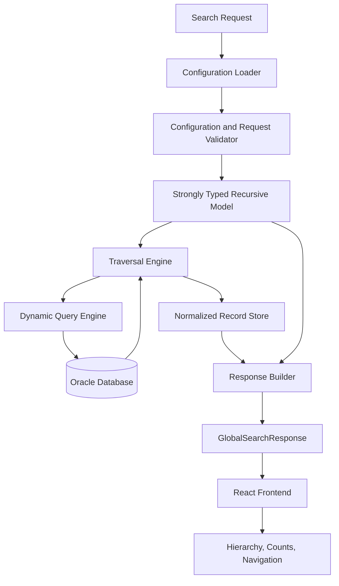
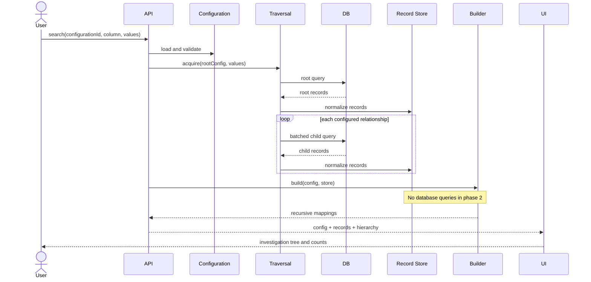

# Global Search

Global Search is a configuration-driven investigation platform built at Osfin.ai for implementation and operations teams. The name is historical: the problem was not finding an initial record—individual modules already supported search—but investigating related business data across transactions, merchants, customers, settlements, banking, and disputes.

The project was developed in a FinTech environment during 2023–2024 using Java, Spring Boot, React, Oracle SQL, and REST APIs. The original author, a Software Engineer II, owned the project end to end: stakeholder discovery, configuration design, APIs, dynamic SQL, relationship traversal, result aggregation, performance work, frontend integration, rollout, and subsequent enhancements.

## Business Problem

After locating a record, teams manually moved across modules in a use-case-specific order. The drawbacks were structural:

- investigation knowledge lived with experienced team members;
- every flow had a different sequence and user experience;
- new flows repeated APIs, SQL, DTOs, response builders, tests, and frontend integration;
- small relationship changes required engineering, testing, and deployment;
- effort grew roughly with the number of hardcoded workflows.

The goal was to move workflow definition from code to governed metadata. An implementation team should be able to configure the root entity, searchable columns, parent-child relationships, display fields, and response metadata while reusing one runtime engine.

## Solution

At runtime, the backend loads a selected configuration, validates the requested search column, deserializes the JSON into strongly typed recursive Java objects, executes a root query, follows configured relationships with batched child queries, normalizes every discovered record, and builds a recursive response. The frontend combines the hierarchy with the normalized records to render expandable investigation views and calculate visual counts.

Adding a workflow normally becomes:

1. Define the root module and table.
2. Declare allowed search and display columns.
3. Add parent/child relationship metadata.
4. Validate and deploy the configuration.
5. Let the existing traversal and response engines execute it.

No module-specific traversal, repository method, or response-builder change is expected for a valid configuration.

## Architecture



The five core runtime components are:

- **Search configuration:** the recursive investigation blueprint.
- **Traversal engine:** generic DFS that discovers configured entities.
- **Dynamic query engine:** generates safe, metadata-driven queries.
- **Normalized record store:** stores each entity once by table and ID.
- **Response builder:** constructs the hierarchy entirely in memory.

### Two-phase processing

The most important design decision is separating data acquisition from response construction.



Phase 1 discovers records, batches database access, and populates the store. Phase 2 only organizes already-fetched records. This isolation keeps each recursion focused, eliminates response-time database reads, and allows query and presentation optimization to evolve independently.

## Configuration Model

Configurations are stored as JSON but runtime traversal does not walk raw JSON. Deserialization into typed objects improves validation, readability, extension, and recursive code.

Relationship metadata belongs to the edge—not the parent or child node—so the same module definition can participate in different workflows.

```json
{
  "id": "transaction-investigation",
  "root": {
    "module": "Transaction",
    "table": "transaction",
    "idColumn": "id",
    "searchableColumns": ["transaction_id", "merchant_id"],
    "displayColumns": ["transaction_id", "status", "amount"],
    "relatedModules": [
      {
        "parentColumn": "merchant_id",
        "childColumn": "id",
        "config": {
          "module": "Merchant",
          "table": "merchant",
          "idColumn": "id",
          "searchableColumns": ["id"],
          "displayColumns": ["id", "name"],
          "relatedModules": []
        }
      }
    ]
  }
}
```

A request can contain one or more values so the root lookup is also batched:

```json
{
  "configurationId": "transaction-investigation",
  "searchColumn": "transaction_id",
  "searchValues": ["1001", "1002"]
}
```

At minimum, pre-deployment validation should reject unknown tables or columns, missing relationship endpoints, duplicate module definitions, unsupported search columns, excessive depth, and circular references. Database metadata may verify identifiers, but an application allowlist should remain the authorization boundary.

## Focused Java Model

The following records capture the recursive configuration and normalized response contract without module-specific classes:

```java
record SearchConfiguration(
        String module,
        String table,
        String idColumn,
        Set<String> searchableColumns,
        List<String> displayColumns,
        List<RelatedModule> relatedModules) {}

record RelatedModule(
        String parentColumn,
        String childColumn,
        SearchConfiguration config) {}

record SearchRequest(
        String configurationId,
        String searchColumn,
        List<String> searchValues) {}

record RecordMapping(
        String id,
        List<NestedSearchResponse> children) {}

record NestedSearchResponse(
        String module,
        List<RecordMapping> records) {}

record GlobalSearchResponse(
        SearchConfiguration configuration,
        Map<String, Map<String, Map<String, Object>>> recordsByTableAndId,
        NestedSearchResponse hierarchy) {}
```

The normalized store is conceptually:

```text
table -> record ID -> complete business record
```

The hierarchy contains IDs and child mappings rather than copies of business records. This lets multiple branches reference one normalized entity and keeps retrieval separate from hierarchy construction.

## Traversal Algorithm

The recursive shape of `SearchConfiguration` naturally supports depth-first traversal. Business hierarchies were shallow, so DFS had less explicit state than BFS. BFS remains valid when level-wide scheduling, breadth limits, or controlled parallelism matter.

### Phase 1: acquire and normalize

```java
void acquire(
        SearchConfiguration config,
        String searchColumn,
        List<String> values,
        RecordStore store) {

    if (values.isEmpty()) return;
    validateAllowedIdentifier(config, searchColumn);

    List<Map<String, Object>> rows =
            queryExecutor.fetch(config.table(), searchColumn, values);
    store.putAll(config.table(), config.idColumn(), rows);

    for (RelatedModule edge : config.relatedModules()) {
        List<String> childKeys = rows.stream()
                .map(row -> row.get(edge.parentColumn()))
                .filter(Objects::nonNull)
                .map(Object::toString)
                .distinct()
                .toList();

        acquire(edge.config(), edge.childColumn(), childKeys, store);
    }
}
```

For each module, the engine executes the current query, stores results, collects distinct relationship values, performs one batched child lookup per configured edge, and recurses. It stops when a node has no children or a query yields no values. A production implementation should also track visited configuration nodes/edges to guard against accidental cycles.

### Phase 2: build mappings

```java
NestedSearchResponse build(
        SearchConfiguration config,
        String column,
        String value,
        RecordStore store) {

    List<RecordMapping> mappings = store.find(config.table(), column, value).stream()
            .map(row -> {
                List<NestedSearchResponse> children = config.relatedModules().stream()
                        .map(edge -> build(
                                edge.config(),
                                edge.childColumn(),
                                Objects.toString(row.get(edge.parentColumn())),
                                store))
                        .toList();
                return new RecordMapping(
                        Objects.toString(row.get(config.idColumn())), children);
            })
            .toList();

    return new NestedSearchResponse(config.module(), mappings);
}
```

For efficient `store.find`, acquisition should build secondary indexes for relationship columns. Without them, repeatedly filtering every table map can make response construction worse than linear.

## Dynamic SQL and Safety

Values can be parameterized; SQL identifiers cannot. Therefore both sides need different controls:

1. Table and column identifiers must come from a trusted, versioned, validated allowlist.
2. User-selected columns must be members of `searchableColumns`.
3. Search values must always use bind parameters.
4. Empty value lists should short-circuit instead of emitting invalid `IN ()`.
5. Large lists must be chunked to respect Oracle's `IN`-list and bind limits.

```sql
SELECT id, transaction_id, merchant_id, status, amount
FROM transaction
WHERE transaction_id IN (:value_0, :value_1);
```

For a child edge:

```sql
SELECT id, transaction_id, name
FROM merchant
WHERE transaction_id IN (:parent_0, :parent_1, :parent_2);
```

Never concatenate request values:

```java
// Identifiers have already passed configuration allowlist validation.
String placeholders = IntStream.range(0, values.size())
        .mapToObj(i -> ":value_" + i)
        .collect(Collectors.joining(", "));
String sql = "SELECT " + validatedProjection
        + " FROM " + validatedTable
        + " WHERE " + validatedColumn + " IN (" + placeholders + ")";
```

Selecting configured projections instead of `SELECT *` reduces I/O and accidental data exposure. Search columns, relationship columns, primary keys, and foreign keys used by traversal require appropriate indexes.

## Batched Retrieval and N+1 Avoidance

Given 100 merchants, querying customers once per merchant creates 100 round trips. The engine instead collects the 100 IDs and executes a batched query:

```sql
SELECT id, merchant_id, customer_name
FROM customer
WHERE merchant_id IN (:merchant_0, :merchant_1, ...);
```

For an acyclic configuration tree with one unchunked query per edge, query count is approximately one root query plus one query per reached relationship: `O(R)`, independent of the number of parent records. In practice, chunking, repeated module paths, retries, and pagination add queries, so `O(R)` is a useful model rather than an unconditional guarantee.

Multiple level-sized queries were chosen over one massive dynamic `JOIN` because a large join can multiply rows, create large intermediates, complicate optional relationships, duplicate business data, and become hard to generate and debug. Smaller batched queries offer predictable plans and localized optimization.

## Response Contract and Frontend Boundary

`GlobalSearchResponse` contains:

- the configuration used for the investigation;
- the normalized table/ID record store;
- a recursive hierarchy of record IDs and child module mappings.

The backend owns configuration loading, validation, traversal, data discovery, normalization, and relationship-preserving response construction. It intentionally does not own UI expansion state, rendering order, layouts, or visual counts. The React frontend resolves IDs against the record store, renders expandable trees, calculates counts, and supports navigation. This boundary allows presentation to evolve without changing traversal.

For multiple root matches, the response should contain one root mapping per matching entity (or a list of root trees), while sharing the same normalized store.

## Correctness and Error Handling

- An unknown configuration ID rejects the request before traversal.
- An unconfigured search column rejects the request before SQL generation.
- A leaf node ends recursion normally.
- Empty results produce an empty mapping and skip child queries; absence is not necessarily an error.
- Invalid edge metadata should fail configuration publication, not repeatedly fail user searches.
- Null relationship values are filtered before child lookup.
- Cycles, duplicate IDs with conflicting values, excessive result size, and depth limits need explicit policies.
- Authorization and row/column-level data access must be enforced independently of configuration validity.

## Complexity

Let `N` be the number of discovered records, `R` the number of reached configured relationships, `D` maximum depth, and `B` the effective database batch size.

- Acquisition application work: `O(N + R)` excluding database execution and serialization.
- Response construction: `O(N + R)` when relationship lookup indexes are built; naive scans can degrade toward `O(N²)`.
- Normalized store and response mappings: `O(N + R)` space.
- Recursion stack: `O(D)`.
- Query count: approximately `1 + Σ ceil(values(edge)/B)`; often described as `O(R)` when each edge fits one batch.

Database latency and query plans dominate Java execution. Linear application complexity does not imply linear end-to-end latency because selectivity, indexes, network transfer, and result size matter.

## Design Decisions and Trade-offs

### Configuration over hardcoded workflows

Configuration reduces repeated engineering and deployment, but shifts complexity into schema governance, validation, versioning, rollout, and debugging. A malformed mapping can return incomplete or incorrect investigations.

### Recursive model

Recursion mirrors hierarchical workflows and supports arbitrary configured depth. Deep or cyclic graphs require limits and cycle detection. Iterative traversal may be safer for untrusted depth.

### Dynamic SQL over repositories

Runtime metadata makes fixed repository methods impractical and repetitive. Dynamic SQL increases flexibility while demanding strict identifier validation, parameterization, projection control, and database-aware tuning.

### Normalized records plus hierarchy

Storing each record once reduces payload and memory duplication and enables reuse across branches. The client contract is more complex than a fully denormalized tree and requires ID resolution.

### DFS over BFS

DFS aligns with recursive configuration and shallow business hierarchies. BFS is preferable when the system needs level-based limits, iterative execution, or broad parallel traversal.

### Relational database over graph database

The data already lived in relational storage and relationships were relatively shallow. Introducing a graph database would add migration and operational complexity without enough benefit. A graph store becomes more compelling for deep, highly connected exploration, variable-length path queries, or graph analytics.

### Caching

Configuration caching is comparatively safe and high value. Query or full-response caching can reduce database load but risks stale investigation data; it requires explicit freshness, invalidation, tenancy, and authorization semantics.

## Performance and Operations

- Batch and de-duplicate relationship values.
- Chunk bind lists using database limits and measured optimal sizes.
- Index root search, parent relationship, child relationship, primary-key, and foreign-key columns.
- Cache validated, immutable configuration versions.
- Set depth, row, payload, timeout, and concurrency limits.
- Collect per-node query latency, rows, batch count, selected plan, and total response size.
- Include a correlation ID and configuration version in traces.
- Consider parallel child traversal only for independent branches and with bounded database concurrency.
- Paginate or lazily expand very large branches.

The main bottleneck is database access. Response construction is in memory and usually cheaper, though huge investigations increase heap, serialization time, payload size, and frontend rendering cost.

## Impact

The platform converted investigation from a collection of hardcoded flows into a reusable capability. Implementation teams could onboard new scenarios primarily through configuration, standardizing the user experience and reducing repeated backend work. The source describes significant operational-efficiency improvement but provides no measured latency, adoption, or effort-reduction figures; those should not be invented in an interview.

## Future Improvements

- A configuration compiler that checks tables, columns, edges, cycles, duplicates, depth, and access policies before publication.
- Versioned configuration lifecycle with draft, approval, canary, rollback, and audit history.
- Better error messages that identify the exact configuration path and edge.
- Adaptive batch sizing informed by database metrics.
- Bounded parallel traversal for independent child branches.
- Configuration cache with version-aware invalidation.
- Query budgets, pagination, lazy branch expansion, and response streaming.
- Observability dashboards for query count, fan-out, rows, latency, cache behavior, and failures.
- Automatic index recommendations based on configured access paths.
- Stable response schemas and contract tests shared with the frontend.

## Interview Guide

### 30-second explanation

> At Osfin.ai, I built a configuration-driven investigation platform for operations teams. Individual modules already had search, but investigating an issue required manually following different relationships across transactions, merchants, customers, settlements, and disputes. I designed a generic recursive engine where the root entity, searchable columns, relationships, and display metadata are configuration. At runtime it safely generates batched SQL, normalizes related records, and builds the investigation hierarchy in a second in-memory phase. This let new workflows reuse the same backend engine instead of requiring dedicated APIs and traversal code.

### Two-minute structure

1. Start with the investigation problem, not recursion or classes.
2. Explain why separate APIs duplicated the same root-query/traverse/build pattern.
3. Introduce configuration as the variable part and the engine as the stable part.
4. Walk through batched recursive acquisition and the normalized store.
5. Explain the database-free response phase.
6. Close with impact, trade-offs, and improvements.

### High-value follow-ups

**Why configuration-driven?** Business workflows and relationships changed faster than the application. Moving the variable behavior into validated metadata reduced code changes, testing duplication, and deployments.

**Why recursion?** Every module may contain configured children, so the data and configuration are recursive. DFS maps directly to that structure and was appropriate for shallow workflows.

**How was N+1 avoided?** Parent relationship values are collected and de-duplicated at each edge, then queried in an `IN` batch instead of one query per parent.

**Why two phases?** Mixing retrieval and response composition made recursion hard to understand, caused duplicate access risks, and coupled query optimization to API shape. Separating them gave each algorithm one responsibility.

**Why not one huge join?** Dynamic optional relationships and one-to-many edges can cause row explosion and duplicate data. Level-oriented batches are easier to generate, observe, and tune.

**How is dynamic SQL safe?** Values use bind parameters. Tables, columns, and projections come only from trusted, prevalidated configuration allowlists. User input never becomes an SQL identifier or concatenated value.

**How many queries run?** Roughly one root query plus batches for each reached edge. State the chunking caveat rather than claiming a fixed query count.

**What would you improve now?** Configuration compilation and governance, observability, descriptive errors, adaptive batching, bounded branch parallelism, limits/pagination, and version-aware configuration caching.

**What was the strongest contribution?** Designing and implementing the generic traversal engine and its configuration model, including dynamic SQL, normalization, batched retrieval, and the frontend response contract.

**What architectural decision mattered most?** Separating database traversal from response construction. It simplified recursion, debugging, optimization, and independent evolution.

## Key Takeaways

- Call it a **configuration-driven investigation platform**, not a generic search engine.
- Every module already had search; cross-module investigation was the gap.
- Explain business motivation before recursion or implementation.
- Mention batching before presenting complexity.
- The durable architecture is configuration → generic traversal → normalized data → in-memory hierarchy.
