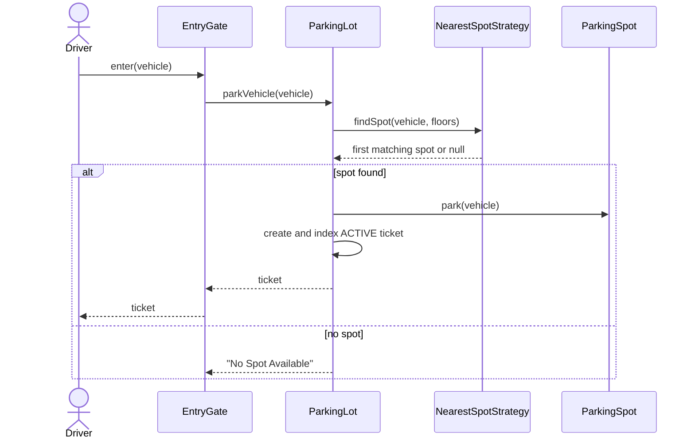
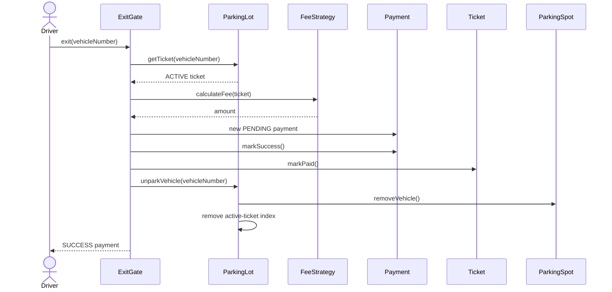
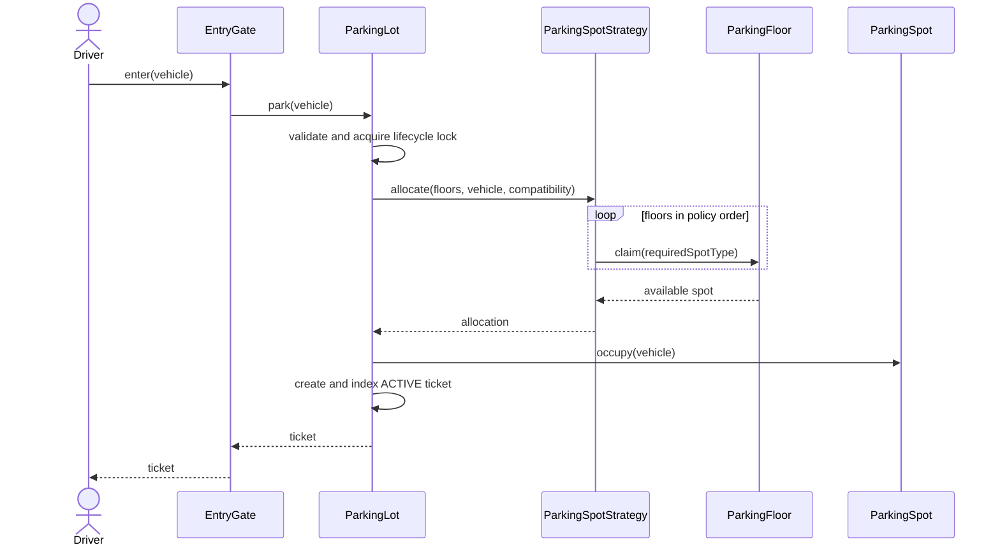

# Parking Lot Sequence Diagrams

Read every Mermaid sequence from top to bottom. Actors are outside callers;
participants are objects or services. The source flows preserve the original
interview behavior. The hardened flows then add the lock, exact fee handling,
payment failure, and atomic state changes needed when multiple gates race.

## Source-derived teaching flow

The source builds the lifecycle in two stages. Entry delegates from the gate
to the lot, uses the configured strategy to find the first compatible free
spot, occupies it, and creates an active ticket:



Exit in the source is requested by vehicle number. The gate validates the
active ticket, delegates pricing, creates a payment that succeeds immediately,
marks the ticket paid, and asks the lot to release the spot:



That compact sequence is the source's interview teaching design. It does not
model concurrent claims, failed payment, partial rollback, or a distinct
payment processor.

## Editorial hardened design / Professional corrections

### Vehicle entry

This Mermaid sequence introduces corrected vehicle entry. One lifecycle lock
covers pool claim, spot occupation, and ticket indexing, so two gates cannot
both receive the same spot.



If no compatible pool contains a spot, allocation fails without creating a ticket. The lock makes pool removal, occupancy, and ticket indexing one atomic operation.

### Payment and exit

This Mermaid sequence introduces corrected payment and exit. It shows the
success and failure branches explicitly: only success closes the ticket and
returns the spot to availability.

```mermaid
sequenceDiagram
    actor Driver
    participant Gate as ExitGate
    participant Lot as ParkingLot
    participant Fee as FeeStrategy
    participant Processor as PaymentProcessor
    participant Ticket
    participant Floor as ParkingFloor
    participant Spot as ParkingSpot

    Driver->>Gate: exit(ticketId)
    Gate->>Lot: payAndExit(ticketId)
    Lot->>Lot: acquire lock and validate ACTIVE ticket
    Lot->>Fee: calculate(ticket, clock.instant())
    Fee-->>Lot: amountMinor
    Lot->>Processor: capture(PENDING payment)
    alt payment succeeds
        Processor-->>Lot: true
        Lot->>Ticket: markPaid(exitTime)
        Lot->>Spot: release()
        Lot->>Floor: return spot to availability pool
        Lot->>Lot: remove active indexes
        Lot-->>Gate: SUCCESS payment
        Gate-->>Driver: receipt
    else payment fails
        Processor-->>Lot: false
        Lot->>Lot: mark payment FAILED
        Lot-->>Gate: payment error
        Note over Ticket,Spot: Ticket remains ACTIVE; spot remains occupied
    end
```

The hardened flow intentionally differs: it exits by ticket ID, injects time
and payment behavior, preserves the occupied spot after payment failure, and
atomically updates the spot, availability pool, ticket state, and active
indexes. The sample processor is local and deterministic; a production remote
capture should use a `PAYMENT_PENDING` workflow, idempotency, and short
transactional finalization rather than holding a JVM lock across network I/O.

[Back to the case study](../README.md)
