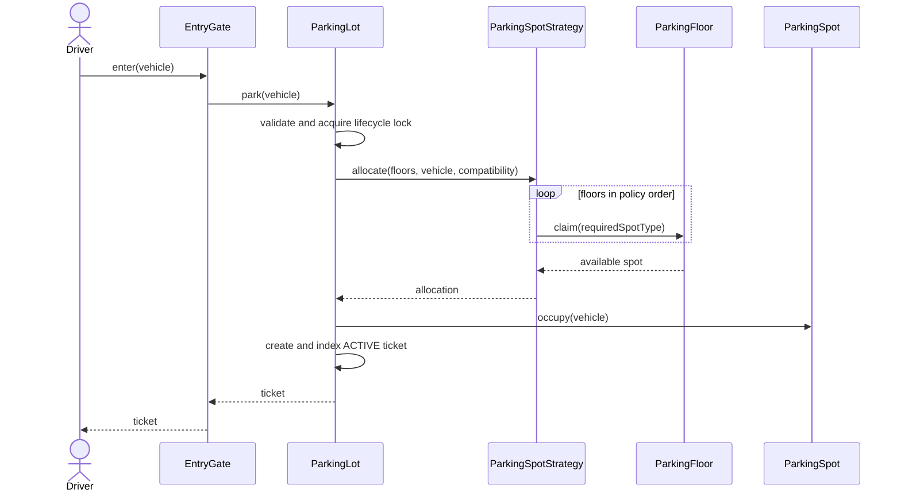

# Parking Lot Sequence Diagrams

## Vehicle Entry



If no compatible pool contains a spot, allocation fails without creating a ticket. The lock makes pool removal, occupancy, and ticket indexing one atomic operation.

## Payment and Exit

```mermaid
sequenceDiagram
    actor Driver
    participant Gate as ExitGate
    participant Lot as ParkingLot
    participant Fee as FeeStrategy
    participant Processor as PaymentProcessor
    participant Ticket
    participant Floor as ParkingFloor
    participant Spot as ParkingSpot

    Driver->>Gate: exit(ticketId)
    Gate->>Lot: payAndExit(ticketId)
    Lot->>Lot: acquire lock and validate ACTIVE ticket
    Lot->>Fee: calculate(ticket, clock.instant())
    Fee-->>Lot: amountMinor
    Lot->>Processor: capture(PENDING payment)
    alt payment succeeds
        Processor-->>Lot: true
        Lot->>Ticket: markPaid(exitTime)
        Lot->>Spot: release()
        Lot->>Floor: return spot to availability pool
        Lot->>Lot: remove active indexes
        Lot-->>Gate: SUCCESS payment
        Gate-->>Driver: receipt
    else payment fails
        Processor-->>Lot: false
        Lot->>Lot: mark payment FAILED
        Lot-->>Gate: payment error
        Note over Ticket,Spot: Ticket remains ACTIVE; spot remains occupied
    end
```

[Back to the case study](../README.md)
