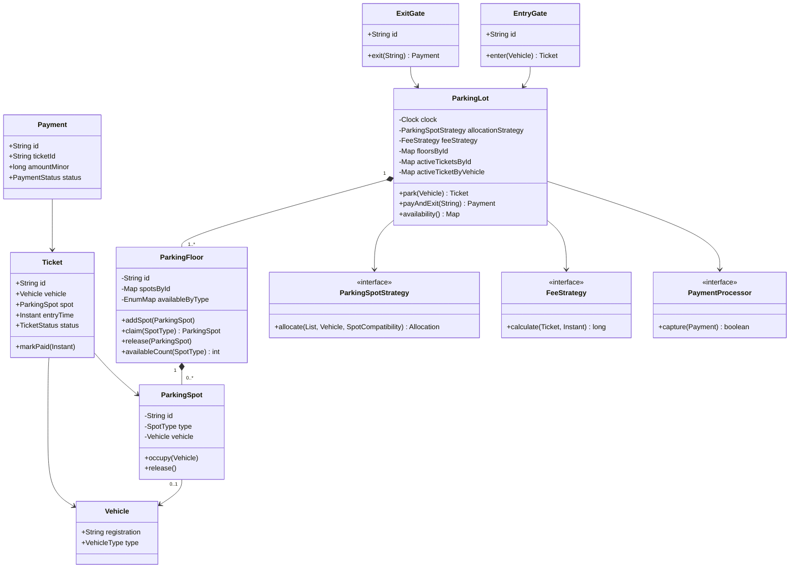

# Parking Lot Class Diagram

The strategy interfaces isolate behaviors expected to change. Floors own spot collections and constant-time availability pools, while the lot owns cross-floor invariants and ticket/payment coordination.

[Back to the case study](../README.md)
