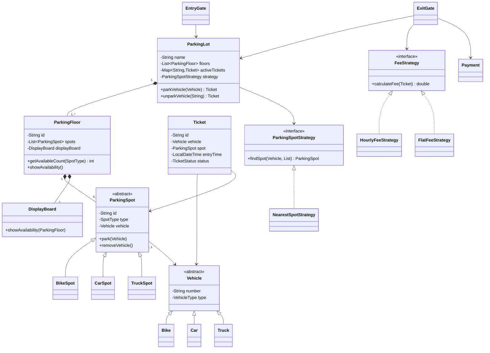

# Parking Lot Class Diagram

A driver does not interact with every class. Entry and exit gates delegate to
`ParkingLot`; the lot coordinates floors, spots, tickets, policies, and payment.
The first Mermaid diagram preserves the source teaching hierarchy. The second
shows the hardened value model and additional consistency boundaries. Compare
them as original versus corrected, not as two simultaneous implementations.

## Source-derived teaching design

This conceptual view preserves the source's explicit inheritance hierarchies
and the final class-diagram meaning:

The source diagram means that the lot coordinates floors, active tickets, and
allocation policy; floors contain spots and their display; tickets bind
vehicles to spots; gates delegate entry/exit; and two independent Strategy
families isolate allocation and pricing. The source class called
`NearestSpotStrategy` actually returns the first matching spot in floor/list
order, not a distance-based nearest spot.

## Editorial hardened design / Professional corrections

The next Mermaid class diagram introduces the corrected implementation. It
flattens behavior-free subtypes, makes payment and compatibility injectable,
and puts availability pools and lifecycle updates behind `ParkingLot`.

The hardened diagram flattens behavior-free bike/car/truck subclasses into
typed values, adds explicit compatibility and payment processing, uses
constant-time floor/type pools, and centralizes lifecycle invariants in the
lot. `Clock`, locking, typed errors, and immutable availability snapshots are
implementation concerns described in [Design.md](../Design.md); the strategy
interfaces still isolate the two behaviors expected to change.

[Back to the case study](../README.md)
