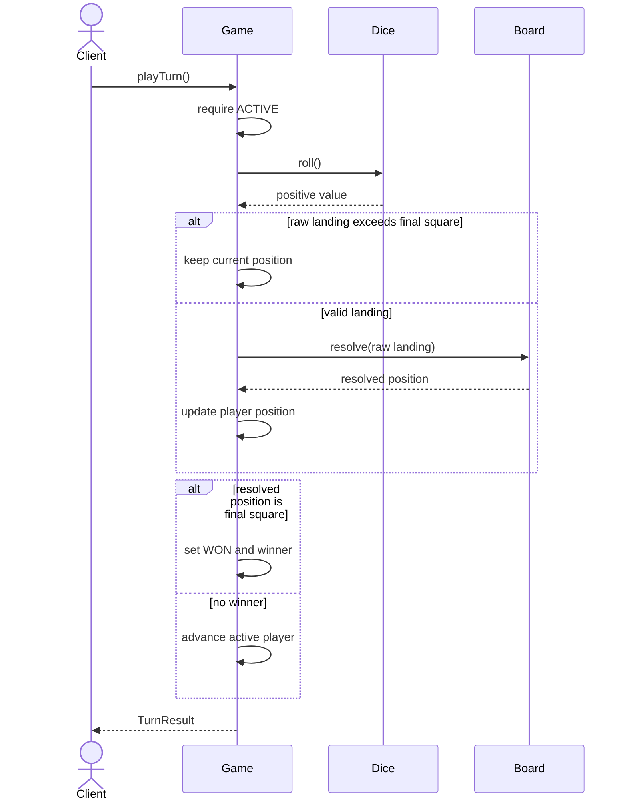

# Turn Sequence

```mermaid
sequenceDiagram
    actor Client
    participant Game
    participant Dice
    participant Board

    Client->>Game: playTurn()
    Game->>Game: require ACTIVE
    Game->>Dice: roll()
    Dice-->>Game: positive value
    alt raw landing exceeds final square
        Game->>Game: keep current position
    else valid landing
        Game->>Board: resolve(raw landing)
        Board-->>Game: resolved position
        Game->>Game: update player position
    end
    alt resolved position is final square
        Game->>Game: set WON and winner
    else no winner
        Game->>Game: advance active player
    end
    Game-->>Client: TurnResult
```

The lifecycle and error behavior are detailed in [Design.md](../Design.md). See also the [class diagram](../UML/README.md) and [overview](../README.md).
