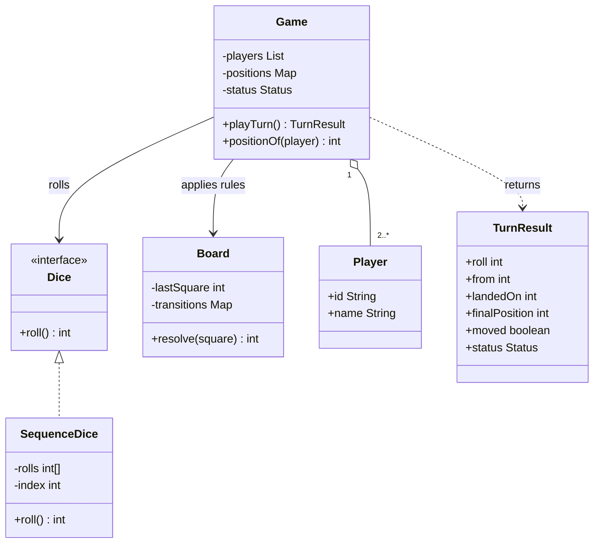

# Class Diagram

During one turn, `Game` asks `Dice` for a roll, asks `Board` to resolve the
landing, updates one `Player` position, and returns `TurnResult`. Each class
exists to isolate randomness, immutable board rules, participant identity, game
lifecycle, or read-only reporting.

The following Mermaid class diagram shows those static relationships. The
sequence diagram explains their runtime order.

See the [design](../Design.md), [sequence diagram](../Sequence-Diagrams/README.md), and [overview](../README.md).
