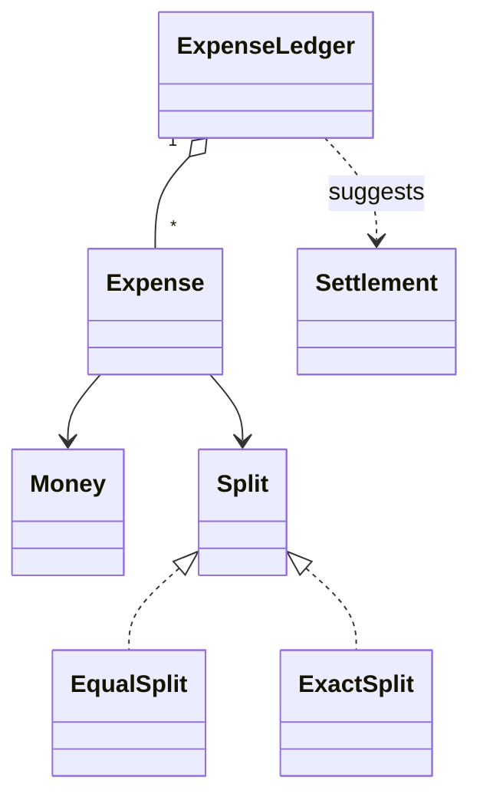
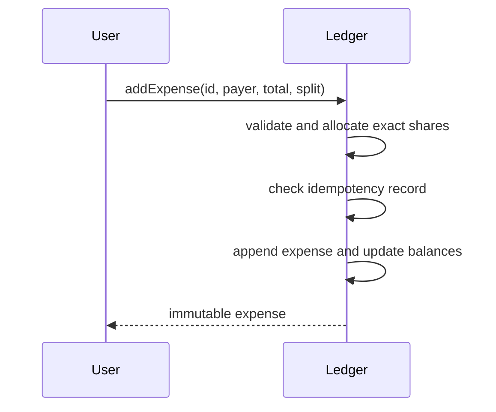

# Splitwise

> **Provenance:** Editorial addition; the matching source stub was empty.

Splitwise records shared expenses and answers a simple question: after several
people pay on one another's behalf, who owes whom? The system converts each
expense into exact debits and credits, keeps every member's net position, and
can suggest transfers that settle those positions.

Members create expenses and request balances or settlements. `ExpenseLedger`
owns the journal and balances; `Expense` records one accepted fact; `Split`
defines how the total is allocated; `Money` preserves exact currency values;
and `Settlement` is an advisory transfer. Positive balances are credits,
negative balances are debts, and the group total must always be zero.

## Problem Statement
Design a shared-expense service that records who paid, allocates exact monetary shares, maintains consistent balances, and suggests settlements without losing cents or duplicating retried expenses.

## Normal Flow, Before the Diagrams

1. A member submits one expense ID, payer, total, and split rule.
2. The ledger converts the total to exact shares in minor units, validates that
   they add back to the total, and creates zero-sum postings.
3. One transaction stores the immutable expense and updates member balances.
4. Reads return the balance projection; settlement reads may suggest who pays
   whom but do not change the ledger.
5. An actual repayment is recorded as another entry so history remains intact.

Two simultaneous expenses for one group can otherwise overwrite a balance
projection. A transaction or version check serializes them. Reusing the same
expense ID is safe only when the normalized payload is identical. Decimal or
integer-minor-unit money avoids floating-point results such as a missing cent.

## Functional Requirements
- Add an expense with equal or exact shares.
- Make expense creation idempotent by expense ID.
- Show each member's net balance.
- Produce a simplified set of debtor-to-creditor settlements.
- Reject malformed totals, duplicate participants, and conflicting retries.

Detailed behavior is in [Requirements](Requirements.md).

## Non Functional Requirements
- Money arithmetic must be deterministic and exact at currency scale.
- Every accepted expense must preserve a zero-sum ledger.
- Concurrent writes to a group must be serializable and auditable.
- Retries must not change balances more than once.

## Design Decisions
Money uses scaled decimal values rather than binary floating point so cents
are never lost to representation error. Each expense stores its resolved
shares as immutable facts. Equal-split remainder cents are assigned in stable
user-ID order, making retries reproducible. The ledger stores compact net
positions for fast balance and settlement queries, while immutable expense
entries remain the source of truth. See [Design](Design.md).

## Class Diagram

The following Mermaid class diagram introduces the static model: money carries
exact values, split policies allocate shares, immutable expenses preserve facts,
the ledger owns consistency, and settlements are derived suggestions. Runtime
order appears in the next diagram.



Full diagram: [UML](UML/README.md).

## Sequence Diagram

The following diagram introduces the successful write path. It shows
validation, deterministic share allocation, idempotency checking, and the
atomic journal-and-balance update. Failure and settlement flows appear in the
detailed sequence documentation.



Detailed flows: [Sequence Diagrams](Sequence-Diagrams/README.md).

## Complexity
Adding an expense with `p` participants costs `O(p)` time and space. Reading net balances is `O(u)`. Greedy simplification sorts users and then matches debtors to creditors in `O(u log u)` time with at most `u - 1` transfers, where `u` is the number of non-zero users.

## Future Improvements
- Add percentage and share-weight split strategies.
- Support currencies as separate ledgers with explicit conversion events.
- Add expense edits as reversals plus replacements.
- Persist an append-only journal with snapshots and group-level optimistic locking.
- Optimize settlements for constraints such as preferred counterparties or minimum transfer amount.

## Run the Reference Implementation
The Java 17 source and main-based self-tests are at [Splitwise.java](implementation/java/Splitwise.java).

```bash
javac implementation/java/Splitwise.java
java -cp implementation/java Splitwise
```
