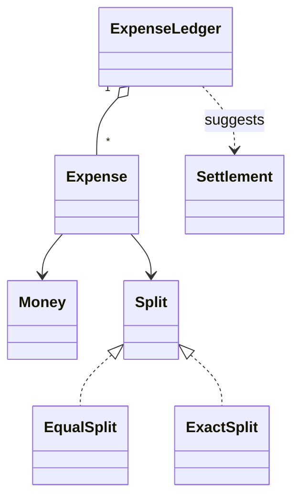
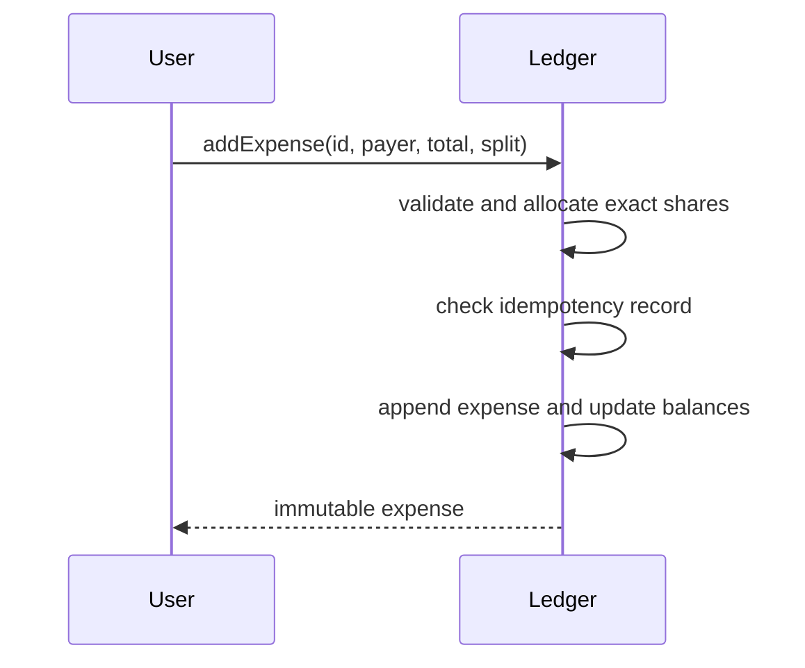

# Splitwise

> **Provenance:** Editorial addition; the matching source stub was empty.

## Problem Statement
Design a shared-expense service that records who paid, allocates exact monetary shares, maintains consistent balances, and suggests settlements without losing cents or duplicating retried expenses.

## Functional Requirements
- Add an expense with equal or exact shares.
- Make expense creation idempotent by expense ID.
- Show each member's net balance.
- Produce a simplified set of debtor-to-creditor settlements.
- Reject malformed totals, duplicate participants, and conflicting retries.

Detailed behavior is in [Requirements](Requirements.md).

## Non Functional Requirements
- Money arithmetic must be deterministic and exact at currency scale.
- Every accepted expense must preserve a zero-sum ledger.
- Concurrent writes to a group must be serializable and auditable.
- Retries must not change balances more than once.

## Design Decisions
Money uses scaled decimal values rather than binary floating point. Each expense stores its resolved shares as immutable facts. Equal-split remainder cents are assigned in stable user-ID order. The ledger stores net positions; this is compact and supports settlement simplification, while immutable expense entries remain the source of truth. See [Design](Design.md).

## Class Diagram



Full diagram: [UML](UML/README.md).

## Sequence Diagram



Detailed flows: [Sequence Diagrams](Sequence-Diagrams/README.md).

## Complexity
Adding an expense with `p` participants costs `O(p)` time and space. Reading net balances is `O(u)`. Greedy simplification sorts users and then matches debtors to creditors in `O(u log u)` time with at most `u - 1` transfers, where `u` is the number of non-zero users.

## Future Improvements
- Add percentage and share-weight split strategies.
- Support currencies as separate ledgers with explicit conversion events.
- Add expense edits as reversals plus replacements.
- Persist an append-only journal with snapshots and group-level optimistic locking.
- Optimize settlements for constraints such as preferred counterparties or minimum transfer amount.

## Run the Reference Implementation
The Java 17 source and main-based self-tests are at [Splitwise.java](implementation/java/Splitwise.java).

```bash
javac implementation/java/Splitwise.java
java -cp implementation/java Splitwise
```
