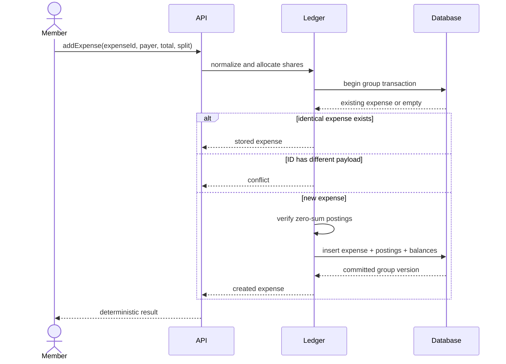
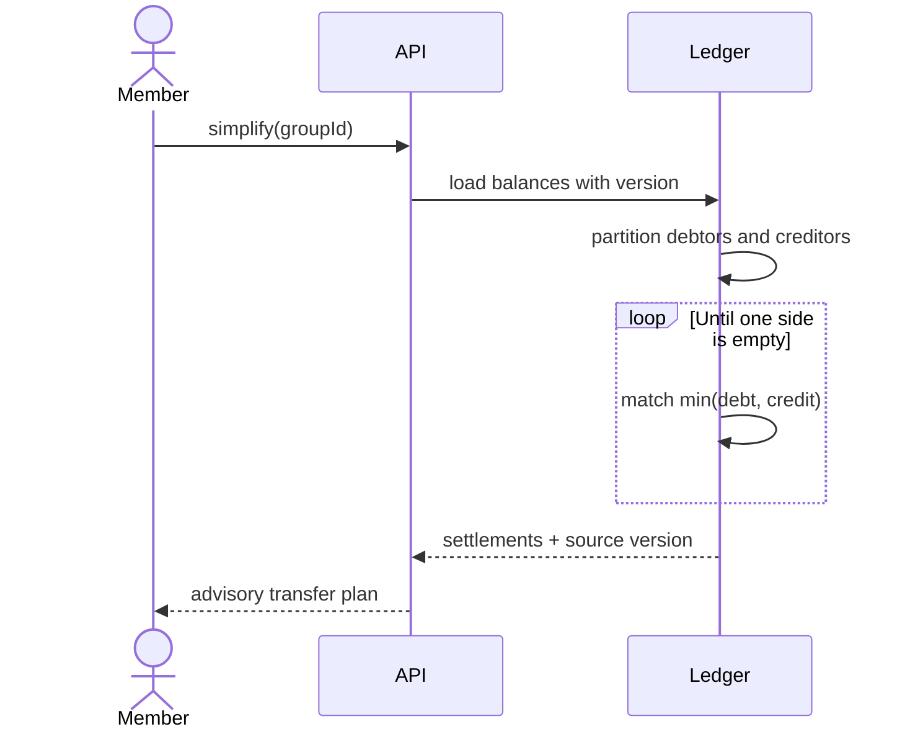

# Splitwise Sequence Diagrams

## Idempotent Expense Creation

## Balance Simplification

The proposal does not mutate balances. A later payment is recorded as a new journal entry, and stale proposals are rejected or recalculated when their source version no longer matches.

Back to the [overview](../README.md), [requirements](../Requirements.md), or [design](../Design.md).
