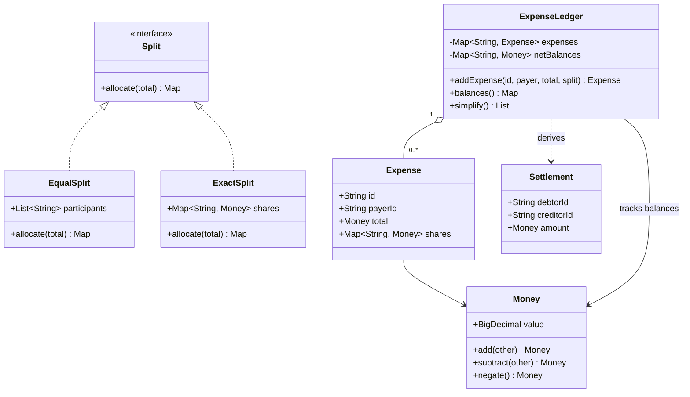

# Splitwise Class Model

Split policies are pure allocation strategies. The ledger validates and atomically applies their immutable result, keeping balance projection logic independent from how shares were requested.

Back to the [overview](../README.md), [design](../Design.md), or [source](../implementation/java/Splitwise.java).
